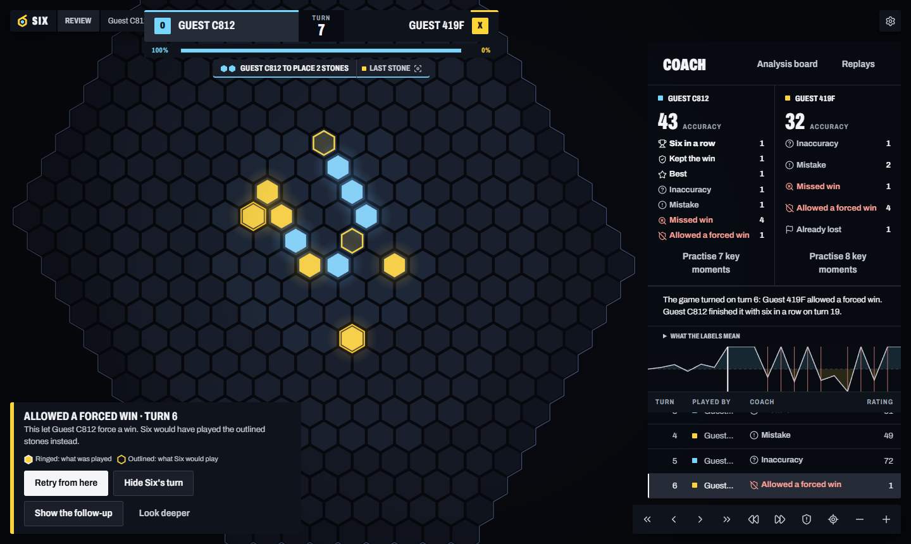

# Six

Hex tic-tac-toe (Connect6 on an endless hex grid) with a bot that learned the game by playing itself.

X opens with one stone, then each player places two stones per turn. First to six in a row wins. Stones can go anywhere within 8 steps of a stone already on the board.

Play it in the browser at **https://playsix.cixmango.workers.dev**, or download it and let the bot think harder on your own GPU.



## Download

From [Releases](https://github.com/CixMango/Six/releases):

- **Windows:** `Six-<version>-windows-x64.zip`. Unzip it anywhere and double-click `Start Six.cmd`. Runs the bot on any DirectX 12 GPU (NVIDIA, AMD or Intel).
- **Linux:** `Six-<version>-linux-x64.tar.gz`. Extract it and run `./start-six.sh`. Uses an NVIDIA GPU when CUDA 12 and cuDNN 9 are installed, the CPU otherwise.

Nothing else to install. The download runs the native engine with the newest network, so at the same thinking time it searches far more than the browser version, and you can give it up to 45 s a turn.

## Features

- Play the bot at several strengths, including older generations of the network
- Play a friend over a LAN or Hamachi (they just open a link)
- Watch bots play each other
- Game review: every turn labelled (best, mistake, blunder, allowed a forced win, ...), Six's better move, the follow-up line, and "retry from here"
- Import games from HeXO links, HTTTX notation or replay files; export any game as HTTTX or a replay file
- Analysis board and saved replays
- Training dashboard for the self-play loop

## Running from source (Windows)

Needs Node 24. Double-click `Start Six.cmd`, or:

```bash
cd web
npm install
npm run dev        # http://localhost:6600
npm run check      # type check + tests
```

The engine bots need the C++ engine. Build it with Visual Studio 2022 (C++ workload, which includes CMake and Ninja):

```bash
engine\build.cmd release
```

Without it the app still runs with the simple built-in bot.

## Layout

| Folder | |
|---|---|
| `web/` | The app: React client, Node server, shared rules, review/coach logic |
| `engine/` | C++ engine: exact threat solver, alpha-beta, MCTS with the network, WebAssembly build for the site |
| `trainer/` | PyTorch training: self-play data, the ResNet, export to ONNX, NNUE experiments |
| `arena/` | Match runner for testing bots against each other (SPRT, paired openings) |
| `remote/` | Lets a friend's PC play self-play games for the training loop |

The rules are implemented separately in TypeScript, C++ and Python, and all three are checked against the same set of recorded games.

## Training

```bash
python -m venv .venv
.venv\Scripts\pip install -r requirements.txt
.venv\Scripts\python trainer\loop.py --help
```

A CUDA GPU is strongly recommended. The trained network is in the release download, not in this repo.

To build the download yourself: `engine\build.cmd dml` (the DirectML engine), then
`node web/scripts/package-release.mjs --net path/to/gen-NNNN/net.onnx`.

## License

MIT, see [LICENSE](LICENSE). That includes the trained network in the release.
