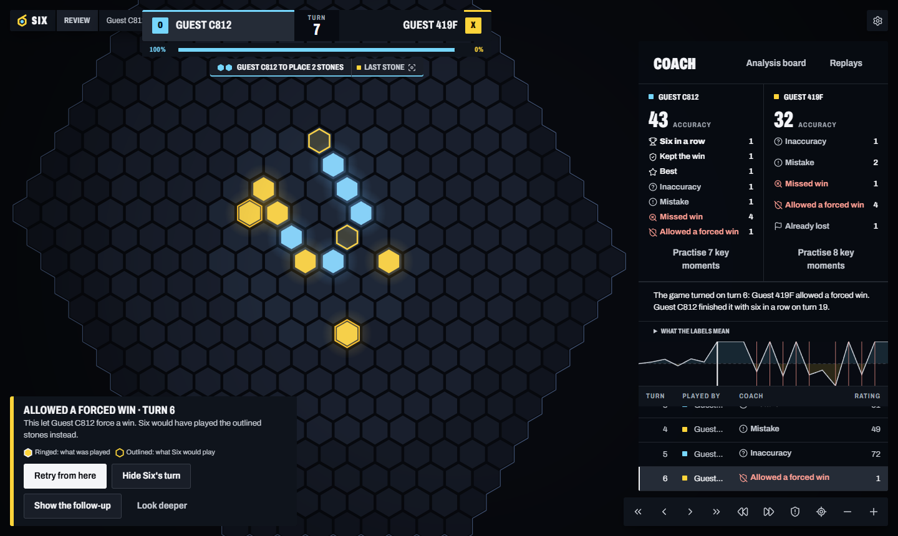

# Six

Hex tic-tac-toe (Connect6 on an endless hex grid) with a bot that learned the game by playing itself.

X opens with one stone, then each player places two stones per turn. First to six in a row wins. Stones can go anywhere within 8 steps of a stone already on the board.

Play it in the browser at **https://playsix.cixmango.workers.dev**, or download it and let the bot think harder on your own GPU.



## Download

From [Releases](https://github.com/CixMango/Six/releases), the installer for your computer:

- **Windows:** `Six-<version>-Setup-windows.exe`. A setup wizard: no admin rights needed, adds Six to the Start menu (and the desktop, if you like). Runs the bot on any DirectX 12 GPU (NVIDIA, AMD or Intel).
- **macOS (Apple Silicon):** `Six-<version>-Setup-macos.pkg`. Puts Six in the Applications folder in your home folder. The first time, right-click the file and choose **Open** (the installer isn't from the App Store). Runs the bot on the Mac's GPU through Metal.
- **Linux (Ubuntu, Debian, Mint, ...):** `Six-<version>-Setup-linux.deb`. Opens in your Software app; then start Six from your apps menu. Runs the bot on AMD, Intel and NVIDIA graphics cards (through Vulkan; NVIDIA uses CUDA instead when CUDA 12 and cuDNN 9 are installed), and on the CPU if there's no usable card.

Six opens in your browser, with no window of its own; quit it from Settings (it also stops by itself a few minutes after its last tab closes). Each time it starts it checks for a new version and offers to update, keeping your saved games.

Or the portable downloads, which run from any folder: `Six-<version>-windows-x64.zip` (double-click `Six`), `Six-<version>-macos-arm64.zip` (right-click `Start Six.command`, **Open**), `Six-<version>-linux-x64.tar.gz` (run `./start-six.sh`).

## Strategy guide

[**Shapes that win**](guide/shapes.md): every small shape of one player's stones, checked by the forced-win solver. Which shapes must be answered (the triangle, the chevron and more), which replies hold, and 21 four-stone shapes that can't be stopped at all.

## Features

- Play the bot at several strengths, including older generations of the network (every 10th one is [published](https://github.com/CixMango/Six/releases/tag/networks) and downloads in the app when you pick it)
- Play a friend over a LAN or Hamachi (they just open a link)
- Watch bots play each other
- Game review: every turn labelled (best, mistake, blunder, allowed a forced win, ...), Six's better move, the follow-up line, and "retry from here"
- Import games from HeXO links, HTTTX notation or replay files, and HeXO sandbox positions; export any game as HTTTX or a replay file
- Analysis board with free placement (set up any position, choose who moves) and Six's suggested turn for either side
- Six thinks by positions by default, so it plays at the same strength on any computer (slower ones just take longer); it can think by time instead
- Saved replays

## Running from source (Windows)

Needs Node 24. Double-click `Start Six.cmd`, or:

```bash
cd web
npm install
npm run dev        # http://localhost:6600
npm run check      # type check + tests
```

The engine bots need the C++ engine. Build it with Visual Studio 2022 (C++ workload, which includes CMake and Ninja):

```bash
engine\build.cmd release
```

Without it the app still runs with the simple built-in bot.

## Layout

| Folder | |
|---|---|
| `web/` | The app: React client, Node server, shared rules, review/coach logic |
| `engine/` | C++ engine: exact threat solver, alpha-beta, MCTS with the network, WebAssembly build for the site |
| `trainer/` | PyTorch training: self-play data, the ResNet, export to ONNX, NNUE experiments |
| `arena/` | Match runner for testing bots against each other (SPRT, paired openings) |
| `remote/` | Lets a friend's PC play self-play games for the training loop |

The rules are implemented separately in TypeScript, C++ and Python, and all three are checked against the same set of recorded games.

## Training

```bash
python -m venv .venv
.venv\Scripts\pip install -r requirements.txt
.venv\Scripts\python trainer\loop.py --help
```

A CUDA GPU is strongly recommended. The trained network is in the release download, not in this repo.

To build the download yourself: `engine\build.cmd dml` (the DirectML engine), then
`node web/scripts/package-release.mjs --net path/to/gen-NNNN/net.onnx`.

## License

MIT, see [LICENSE](LICENSE). That includes the trained network in the release.
