# Shapes that win: catalogue

Every must-answer shape, with its holding replies. The rules and the cheat sheet are on the [main page](shapes.md).

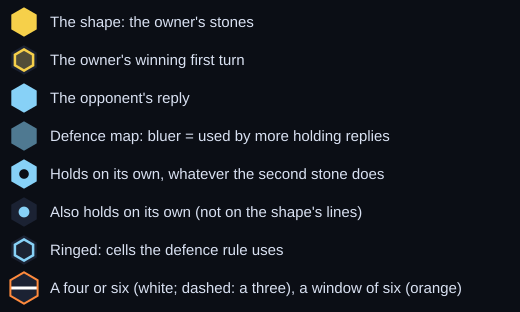

The threes are in the same order as the cheat sheet; the bigger shapes are sorted hardest first, by the share of replies (pairs of empty cells within 3 cells of the shape) that hold. In names like "Chevron 1+2", the numbers are the distances from the corner stone to the other two.

## Summary

| Stones | Shapes | Must-answer | Minimal must-answer | Unstoppable |
|---|---|---|---|---|
| 1 | 1 | 0 | 0 | 0 |
| 2 | 5 | 0 | 0 | 0 |
| 3 | 41 | 16 | 16 | 0 |
| 4 | 779 | 529 | 61 | 21 |
| 5 | 18,237 | 15,536 | 196 | not checked |

A **shape** is some of one player's stones with nothing else nearby; rotations, mirror images and shifts count as the same shape, and stones count as one shape when they're within 2 cells or on one line within 4. **Must-answer:** its owner, to move, has a forced win. **Minimal:** it contains no smaller must-answer shape. **Replies tried:** every pair of empty cells within 3 cells of the shape (within 5 for the unstoppable shapes). **Six on turn N:** its owner makes a four on each of the first N − 1 turns.

## Unstoppable shapes

All 21, most compact first. Each wins even with the opponent to move.

<table>
<tr><td align="center"> <b>U1</b> · Diamond (two triangles) 4 tight threes inside</td><td align="center"> <b>U2</b> 4 tight threes inside</td><td align="center"> <b>U3</b> 3 tight threes inside</td><td align="center"> <b>U4</b> 3 tight threes inside</td></tr>
<tr><td align="center"> <b>U5</b> 3 tight threes inside</td><td align="center"> <b>U6</b> 4 tight threes inside</td><td align="center"> <b>U7</b> 4 tight threes inside</td><td align="center"> <b>U8</b> 3 tight threes inside</td></tr>
<tr><td align="center"> <b>U9</b> 3 tight threes inside</td><td align="center"> <b>U10</b> 2 tight threes inside</td><td align="center"> <b>U11</b> 2 tight threes inside</td><td align="center"> <b>U12</b> 3 tight threes inside</td></tr>
<tr><td align="center"> <b>U13</b> 4 tight threes inside</td><td align="center"> <b>U14</b> 2 tight threes inside</td><td align="center"> <b>U15</b> 4 tight threes inside</td><td align="center"> <b>U16</b> 2 tight threes inside</td></tr>
<tr><td align="center"> <b>U17</b> 3 tight threes inside</td><td align="center"> <b>U18</b> 2 tight threes inside</td><td align="center"> <b>U19</b> 4 tight threes inside</td><td align="center"> <b>U20</b> 2 tight threes inside</td></tr>
<tr><td align="center"> <b>U21</b> 2 tight threes inside</td></tr>
</table>

## 3-stone must-answer shapes

### A1 · Triangle 1+1

<table><tr><td align="center"> Winning first turn</td><td align="center"> Holds</td><td align="center"> Holds</td></tr></table>

**4.8% of replies hold · needs both stones · all 48 two-lines pairs hold**

Defence map and more holding replies

   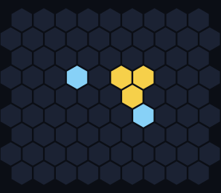 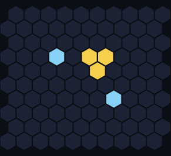

### A2 · Triangle 1+2

<table><tr><td align="center"> Winning first turn</td><td align="center"> Holds</td><td align="center"> Holds</td></tr></table>

**5.1% of replies hold · needs both stones · all 20 two-lines pairs hold**

Defence map and more holding replies

   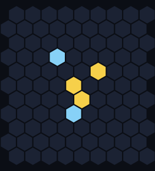 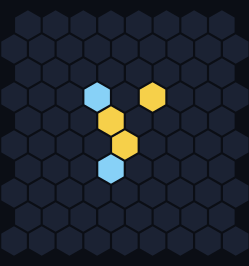

### A3 · Triangle 1+3

<table><tr><td align="center"> Winning first turn</td><td align="center"> Holds</td><td align="center"> Holds</td></tr></table>

**5.8% of replies hold · needs both stones · all 24 two-lines pairs hold**

Defence map and more holding replies

   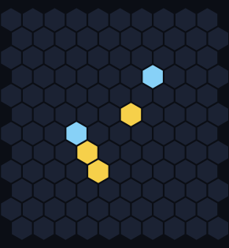 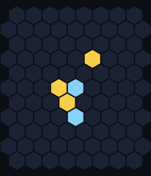

### A4 · Triangle 2+2

<table><tr><td align="center"> Winning first turn</td><td align="center"> Holds</td><td align="center"> Holds</td></tr></table>

**4.9% of replies hold · needs both stones · all 75 two-lines pairs hold**

Defence map and more holding replies

   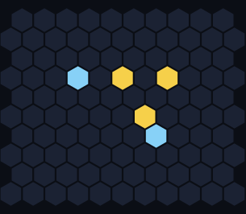 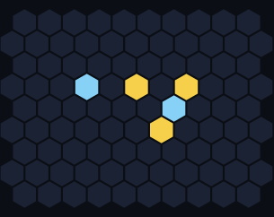

### A5 · Triangle 2+3

<table><tr><td align="center"> Winning first turn</td><td align="center"> Holds</td><td align="center"> Holds</td></tr></table>

**5.5% of replies hold · needs both stones · all 30 two-lines pairs hold**

Defence map and more holding replies

   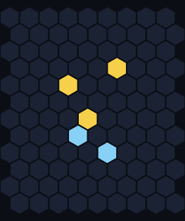 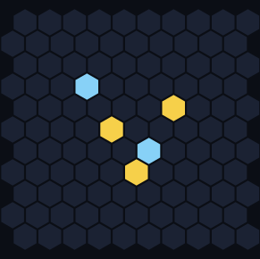

### A6 · Triangle 3+3

<table><tr><td align="center"> Winning first turn</td><td align="center"> Holds</td><td align="center"> Holds</td></tr></table>

**5.2% of replies hold · needs both stones · all 108 two-lines pairs hold**

Defence map and more holding replies

   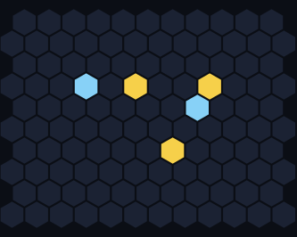 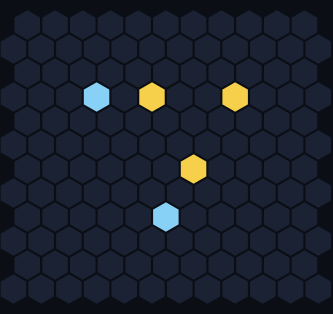

### A7 · Chevron 1+1

<table><tr><td align="center"> Winning first turn</td><td align="center"> Holds</td><td align="center"> Holds</td></tr></table>

**5.4% of replies hold · needs both stones · all 16 two-lines pairs hold**

Defence map and more holding replies

   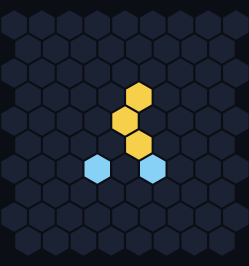 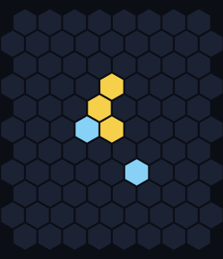

### A8 · Chevron 1+2

<table><tr><td align="center"> Winning first turn</td><td align="center"> Holds</td><td align="center"> Holds</td></tr></table>

**6.4% of replies hold · needs both stones · all 20 two-lines pairs hold**

Defence map and more holding replies

   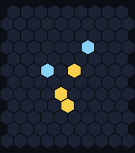 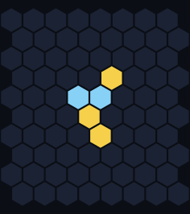

### A9 · Chevron 1+3

<table><tr><td align="center"> Winning first turn</td><td align="center"> Holds</td><td align="center"> Holds</td></tr></table>

**35% of replies hold · one stone is enough on the 11 dotted cells in the map below**

Defence map and more holding replies

   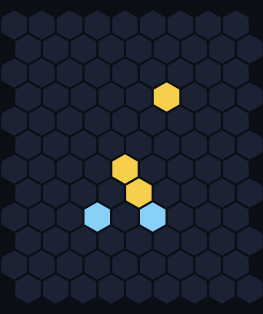 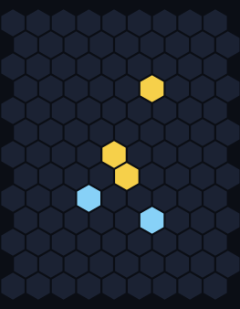

### A10 · Chevron 2+2

<table><tr><td align="center"> Winning first turn</td><td align="center"> Holds</td><td align="center"> Holds</td></tr></table>

**32% of replies hold · one stone is enough on the 10 dotted cells in the map below**

Defence map and more holding replies

   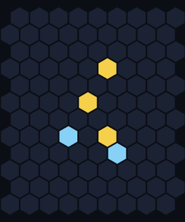 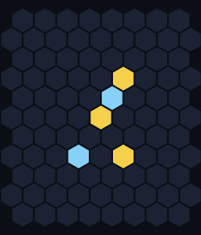

### A11 · Chevron 2+3

<table><tr><td align="center"> Winning first turn</td><td align="center"> Holds</td><td align="center"> Holds</td></tr></table>

**46% of replies hold · one stone is enough on the 17 dotted cells in the map below**

Defence map and more holding replies

   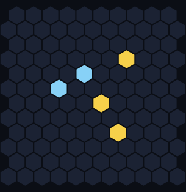 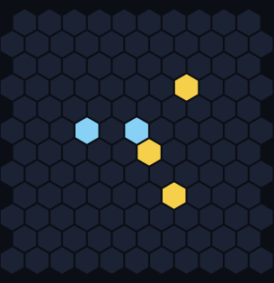

### A12 · Pair + 1 (2,3)

<table><tr><td align="center"> Winning first turn</td><td align="center"> Holds</td><td align="center"> Holds</td></tr></table>

**21% of replies hold · one stone is enough on the 5 dotted cells in the map below**

Defence map and more holding replies

   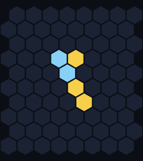 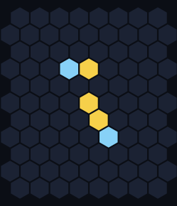

### A13 · Split pair + 1 (2,3)

<table><tr><td align="center"> Winning first turn</td><td align="center"> Holds</td><td align="center"> Holds</td></tr></table>

**19% of replies hold · one stone is enough on the 5 dotted cells in the map below**

Defence map and more holding replies

   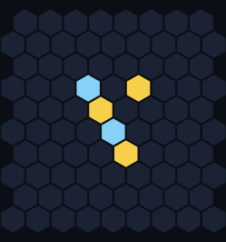 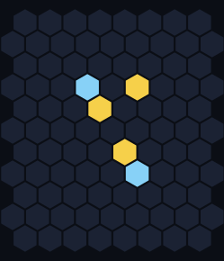

### A14 · Split pair + 1 (2,4)

<table><tr><td align="center"> Winning first turn</td><td align="center"> Holds</td><td align="center"> Holds</td></tr></table>

**35% of replies hold · one stone is enough on the 11 dotted cells in the map below**

Defence map and more holding replies

   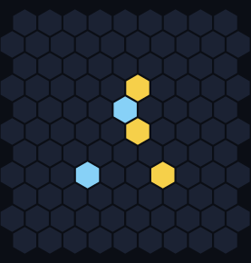 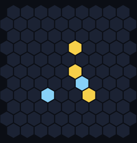

### A15 · Wide pair + 1 (2,2)

<table><tr><td align="center"> Winning first turn</td><td align="center"> Holds</td><td align="center"> Holds</td></tr></table>

**21% of replies hold · one stone is enough on the 6 dotted cells in the map below**

Defence map and more holding replies

   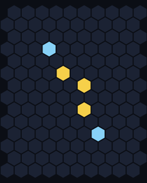 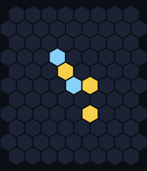

### A16 · Wide pair + 1 (2,4)

<table><tr><td align="center"> Winning first turn</td><td align="center"> Holds</td><td align="center"> Holds</td></tr></table>

**33% of replies hold · one stone is enough on the 11 dotted cells in the map below**

Defence map and more holding replies

   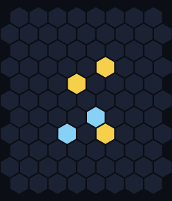 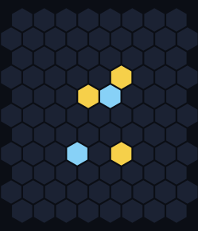

## 4 stones: a three plus one

14 shapes. Three stones in one window of six, plus a fourth stone off that line.

<table>
<tr>
<td align="center"> <b>B1</b> · six on turn 6 16% hold · 5 one-stone cells</td>
<td align="center"> <b>B2</b> · six on turn 6 16% hold · 5 one-stone cells</td>
<td align="center"> <b>B3</b> · six on turn 5 18% hold · 7 one-stone cells</td>
<td align="center"> <b>B4</b> · six on turn 5 19% hold · 7 one-stone cells</td>
</tr>
<tr>
<td align="center"> <b>B5</b> · six on turn 5 19% hold · 7 one-stone cells</td>
<td align="center"> <b>B6</b> · six on turn 5 20% hold · 8 one-stone cells</td>
<td align="center"> <b>B7</b> · six on turn 5 20% hold · 8 one-stone cells</td>
<td align="center"> <b>B8</b> · six on turn 5 21% hold · 8 one-stone cells</td>
</tr>
<tr>
<td align="center"> <b>B9</b> · six on turn 5 21% hold · 8 one-stone cells</td>
<td align="center"> <b>B10</b> · six on turn 6 24% hold · 9 one-stone cells</td>
<td align="center"> <b>B11</b> · six on turn 6 25% hold · 9 one-stone cells</td>
<td align="center"> <b>B12</b> · six on turn 6 25% hold · 9 one-stone cells</td>
</tr>
<tr>
<td align="center"> <b>B13</b> · six on turn 6 28% hold · 10 one-stone cells</td>
<td align="center"> <b>B14</b> · six on turn 6 35% hold · 14 one-stone cells</td>
</tr>
</table>

Holding replies for each

### B1

<table><tr><td align="center"> Winning first turn</td><td align="center"> Holds</td><td align="center"> Holds</td></tr></table>

**Six on turn 6 · 16% of replies hold · one stone is enough on the 5 dotted cells in the map below**

Defence map and more holding replies

   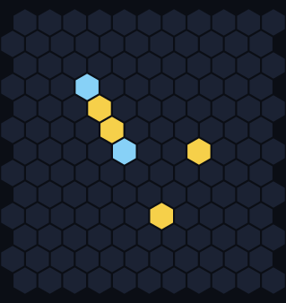 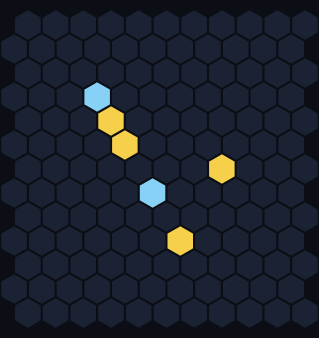

### B2

<table><tr><td align="center"> Winning first turn</td><td align="center"> Holds</td><td align="center"> Holds</td></tr></table>

**Six on turn 6 · 16% of replies hold · one stone is enough on the 5 dotted cells in the map below**

Defence map and more holding replies

   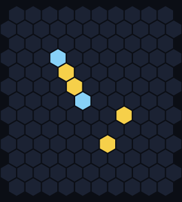 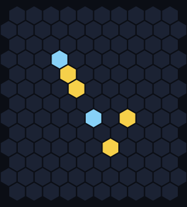

### B3

<table><tr><td align="center"> Winning first turn</td><td align="center"> Holds</td><td align="center"> Holds</td></tr></table>

**Six on turn 5 · 18% of replies hold · one stone is enough on the 7 dotted cells in the map below**

Defence map and more holding replies

   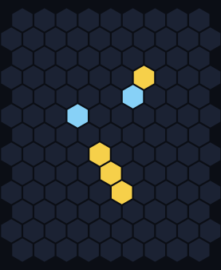 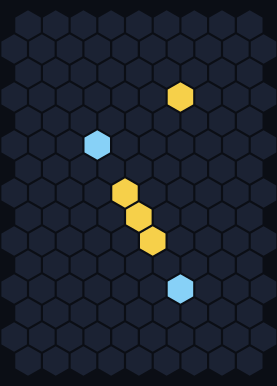

### B4

<table><tr><td align="center"> Winning first turn</td><td align="center"> Holds</td><td align="center"> Holds</td></tr></table>

**Six on turn 5 · 19% of replies hold · one stone is enough on the 7 dotted cells in the map below**

Defence map and more holding replies

   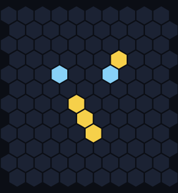 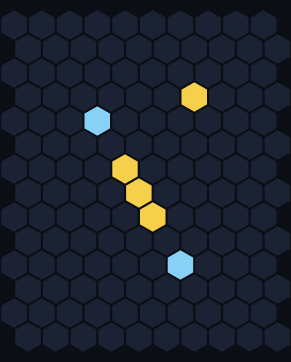

### B5

<table><tr><td align="center"> Winning first turn</td><td align="center"> Holds</td><td align="center"> Holds</td></tr></table>

**Six on turn 5 · 19% of replies hold · one stone is enough on the 7 dotted cells in the map below**

Defence map and more holding replies

   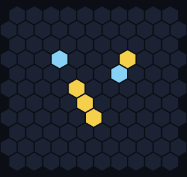 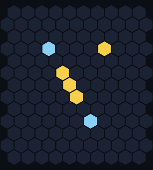

### B6

<table><tr><td align="center"> Winning first turn</td><td align="center"> Holds</td><td align="center"> Holds</td></tr></table>

**Six on turn 5 · 20% of replies hold · one stone is enough on the 8 dotted cells in the map below**

Defence map and more holding replies

   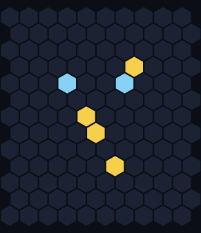 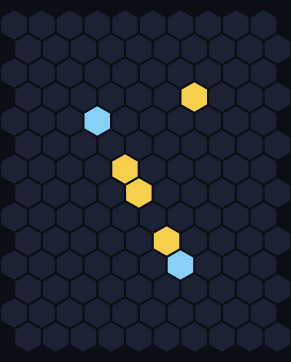

### B7

<table><tr><td align="center"> Winning first turn</td><td align="center"> Holds</td><td align="center"> Holds</td></tr></table>

**Six on turn 5 · 20% of replies hold · one stone is enough on the 8 dotted cells in the map below**

Defence map and more holding replies

   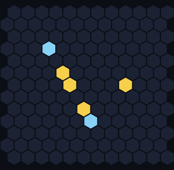 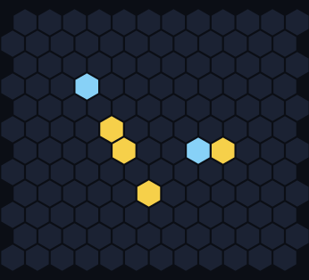

### B8

<table><tr><td align="center"> Winning first turn</td><td align="center"> Holds</td><td align="center"> Holds</td></tr></table>

**Six on turn 5 · 21% of replies hold · one stone is enough on the 8 dotted cells in the map below**

Defence map and more holding replies

   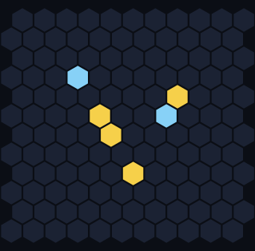 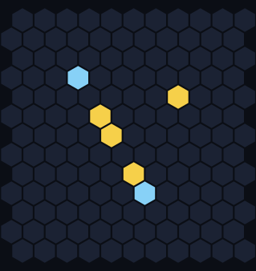

### B9

<table><tr><td align="center"> Winning first turn</td><td align="center"> Holds</td><td align="center"> Holds</td></tr></table>

**Six on turn 5 · 21% of replies hold · one stone is enough on the 8 dotted cells in the map below**

Defence map and more holding replies

   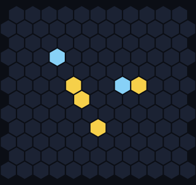 

### B10

<table><tr><td align="center"> Winning first turn</td><td align="center"> Holds</td><td align="center"> Holds</td></tr></table>

**Six on turn 6 · 24% of replies hold · one stone is enough on the 9 dotted cells in the map below**

Defence map and more holding replies

    

### B11

<table><tr><td align="center"> Winning first turn</td><td align="center"> Holds</td><td align="center"> Holds</td></tr></table>

**Six on turn 6 · 25% of replies hold · one stone is enough on the 9 dotted cells in the map below**

Defence map and more holding replies

    

### B12

<table><tr><td align="center"> Winning first turn</td><td align="center"> Holds</td><td align="center"> Holds</td></tr></table>

**Six on turn 6 · 25% of replies hold · one stone is enough on the 9 dotted cells in the map below**

Defence map and more holding replies

    

### B13

<table><tr><td align="center"> Winning first turn</td><td align="center"> Holds</td><td align="center"> Holds</td></tr></table>

**Six on turn 6 · 28% of replies hold · one stone is enough on the 10 dotted cells in the map below**

Defence map and more holding replies

    

### B14

<table><tr><td align="center"> Winning first turn</td><td align="center"> Holds</td><td align="center"> Holds</td></tr></table>

**Six on turn 6 · 35% of replies hold · one stone is enough on the 14 dotted cells in the map below**

Defence map and more holding replies

    

## 4 stones: two pairs

40 shapes. No three of the stones share a window of six, so nothing looks like a line yet. These are the easiest to overlook.

<table>
<tr>
<td align="center"> <b>B15</b> · six on turn 5 6.9% hold · 1 one-stone cell</td>
<td align="center"> <b>B16</b> · six on turn 5 7.2% hold · 1 one-stone cell</td>
<td align="center"> <b>B17</b> · six on turn 6 12% hold · 5 one-stone cells</td>
<td align="center"> <b>B18</b> · six on turn 5 14% hold · 4 one-stone cells</td>
</tr>
<tr>
<td align="center"> <b>B19</b> · six on turn 6 14% hold · 5 one-stone cells</td>
<td align="center"> <b>B20</b> · six on turn 6 14% hold · 6 one-stone cells</td>
<td align="center"> <b>B21</b> · six on turn 6 14% hold · 5 one-stone cells</td>
<td align="center"> <b>B22</b> · six on turn 6 15% hold · 5 one-stone cells</td>
</tr>
<tr>
<td align="center"> <b>B23</b> · six on turn 6 15% hold · 6 one-stone cells</td>
<td align="center"> <b>B24</b> · six on turn 6 16% hold · 5 one-stone cells</td>
<td align="center"> <b>B25</b> · six on turn 6 21% hold · 10 one-stone cells</td>
<td align="center"> <b>B26</b> · six on turn 5 21% hold · 6 one-stone cells</td>
</tr>
<tr>
<td align="center"> <b>B27</b> · six on turn 6 22% hold · 10 one-stone cells</td>
<td align="center"> <b>B28</b> · six on turn 6 23% hold · 11 one-stone cells</td>
<td align="center"> <b>B29</b> · six on turn 6 24% hold · 11 one-stone cells</td>
<td align="center"> <b>B30</b> · six on turn 6 24% hold · 10 one-stone cells</td>
</tr>
<tr>
<td align="center"> <b>B31</b> · six on turn 6 24% hold · 10 one-stone cells</td>
<td align="center"> <b>B32</b> · six on turn 6 26% hold · 10 one-stone cells</td>
<td align="center"> <b>B33</b> · six on turn 5 27% hold · 10 one-stone cells</td>
<td align="center"> <b>B34</b> · six on turn 5 27% hold · 12 one-stone cells</td>
</tr>
<tr>
<td align="center"> <b>B35</b> · six on turn 5 28% hold · 11 one-stone cells</td>
<td align="center"> <b>B36</b> · six on turn 6 28% hold · 11 one-stone cells</td>
<td align="center"> <b>B37</b> · six on turn 6 28% hold · 12 one-stone cells</td>
<td align="center"> <b>B38</b> · six on turn 5 29% hold · 12 one-stone cells</td>
</tr>
<tr>
<td align="center"> <b>B39</b> · six on turn 6 34% hold · 17 one-stone cells</td>
<td align="center"> <b>B40</b> · six on turn 7 34% hold · 16 one-stone cells</td>
<td align="center"> <b>B41</b> · six on turn 5 34% hold · 13 one-stone cells</td>
<td align="center"> <b>B42</b> · six on turn 7 37% hold · 16 one-stone cells</td>
</tr>
<tr>
<td align="center"> <b>B43</b> · six on turn 6 37% hold · 17 one-stone cells</td>
<td align="center"> <b>B44</b> · six on turn 7 38% hold · 20 one-stone cells</td>
<td align="center"> <b>B45</b> · six on turn 5 38% hold · 17 one-stone cells</td>
<td align="center"> <b>B46</b> · six on turn 7 38% hold · 18 one-stone cells</td>
</tr>
<tr>
<td align="center"> <b>B47</b> · six on turn 5 39% hold · 16 one-stone cells</td>
<td align="center"> <b>B48</b> · six on turn 7 40% hold · 20 one-stone cells</td>
<td align="center"> <b>B49</b> · six on turn 6 41% hold · 18 one-stone cells</td>
<td align="center"> <b>B50</b> · six on turn 6 41% hold · 19 one-stone cells</td>
</tr>
<tr>
<td align="center"> <b>B51</b> · six on turn 6 42% hold · 17 one-stone cells</td>
<td align="center"> <b>B52</b> · six on turn 6 43% hold · 18 one-stone cells</td>
<td align="center"> <b>B53</b> · six on turn 6 44% hold · 19 one-stone cells</td>
<td align="center"> <b>B54</b> · six on turn 6 48% hold · 21 one-stone cells</td>
</tr>
</table>

Holding replies for each

### B15

<table><tr><td align="center"> Winning first turn</td><td align="center"> Holds</td><td align="center"> Holds</td></tr></table>

**Six on turn 5 · 6.9% of replies hold · one stone is enough on the 1 dotted cell in the map below**

Defence map and more holding replies

    

### B16

<table><tr><td align="center"> Winning first turn</td><td align="center"> Holds</td><td align="center"> Holds</td></tr></table>

**Six on turn 5 · 7.2% of replies hold · one stone is enough on the 1 dotted cell in the map below**

Defence map and more holding replies

    

### B17

<table><tr><td align="center"> Winning first turn</td><td align="center"> Holds</td><td align="center"> Holds</td></tr></table>

**Six on turn 6 · 12% of replies hold · one stone is enough on the 5 dotted cells in the map below**

Defence map and more holding replies

    

### B18

<table><tr><td align="center"> Winning first turn</td><td align="center"> Holds</td><td align="center"> Holds</td></tr></table>

**Six on turn 5 · 14% of replies hold · one stone is enough on the 4 dotted cells in the map below**

Defence map and more holding replies

    

### B19

<table><tr><td align="center"> Winning first turn</td><td align="center"> Holds</td><td align="center"> Holds</td></tr></table>

**Six on turn 6 · 14% of replies hold · one stone is enough on the 5 dotted cells in the map below**

Defence map and more holding replies

    

### B20

<table><tr><td align="center"> Winning first turn</td><td align="center"> Holds</td><td align="center"> Holds</td></tr></table>

**Six on turn 6 · 14% of replies hold · one stone is enough on the 6 dotted cells in the map below**

Defence map and more holding replies

    

### B21

<table><tr><td align="center"> Winning first turn</td><td align="center"> Holds</td><td align="center"> Holds</td></tr></table>

**Six on turn 6 · 14% of replies hold · one stone is enough on the 5 dotted cells in the map below**

Defence map and more holding replies

    

### B22

<table><tr><td align="center"> Winning first turn</td><td align="center"> Holds</td><td align="center"> Holds</td></tr></table>

**Six on turn 6 · 15% of replies hold · one stone is enough on the 5 dotted cells in the map below**

Defence map and more holding replies

    

### B23

<table><tr><td align="center"> Winning first turn</td><td align="center"> Holds</td><td align="center"> Holds</td></tr></table>

**Six on turn 6 · 15% of replies hold · one stone is enough on the 6 dotted cells in the map below**

Defence map and more holding replies

    

### B24

<table><tr><td align="center"> Winning first turn</td><td align="center"> Holds</td><td align="center"> Holds</td></tr></table>

**Six on turn 6 · 16% of replies hold · one stone is enough on the 5 dotted cells in the map below**

Defence map and more holding replies

    

### B25

<table><tr><td align="center"> Winning first turn</td><td align="center"> Holds</td><td align="center"> Holds</td></tr></table>

**Six on turn 6 · 21% of replies hold · one stone is enough on the 10 dotted cells in the map below**

Defence map and more holding replies

    

### B26

<table><tr><td align="center"> Winning first turn</td><td align="center"> Holds</td><td align="center"> Holds</td></tr></table>

**Six on turn 5 · 21% of replies hold · one stone is enough on the 6 dotted cells in the map below**

Defence map and more holding replies

    

### B27

<table><tr><td align="center"> Winning first turn</td><td align="center"> Holds</td><td align="center"> Holds</td></tr></table>

**Six on turn 6 · 22% of replies hold · one stone is enough on the 10 dotted cells in the map below**

Defence map and more holding replies

    

### B28

<table><tr><td align="center"> Winning first turn</td><td align="center"> Holds</td><td align="center"> Holds</td></tr></table>

**Six on turn 6 · 23% of replies hold · one stone is enough on the 11 dotted cells in the map below**

Defence map and more holding replies

    

### B29

<table><tr><td align="center"> Winning first turn</td><td align="center"> Holds</td><td align="center"> Holds</td></tr></table>

**Six on turn 6 · 24% of replies hold · one stone is enough on the 11 dotted cells in the map below**

Defence map and more holding replies

    

### B30

<table><tr><td align="center"> Winning first turn</td><td align="center"> Holds</td><td align="center"> Holds</td></tr></table>

**Six on turn 6 · 24% of replies hold · one stone is enough on the 10 dotted cells in the map below**

Defence map and more holding replies

    

### B31

<table><tr><td align="center"> Winning first turn</td><td align="center"> Holds</td><td align="center"> Holds</td></tr></table>

**Six on turn 6 · 24% of replies hold · one stone is enough on the 10 dotted cells in the map below**

Defence map and more holding replies

    

### B32

<table><tr><td align="center"> Winning first turn</td><td align="center"> Holds</td><td align="center"> Holds</td></tr></table>

**Six on turn 6 · 26% of replies hold · one stone is enough on the 10 dotted cells in the map below**

Defence map and more holding replies

    

### B33

<table><tr><td align="center"> Winning first turn</td><td align="center"> Holds</td><td align="center"> Holds</td></tr></table>

**Six on turn 5 · 27% of replies hold · one stone is enough on the 10 dotted cells in the map below**

Defence map and more holding replies

    

### B34

<table><tr><td align="center"> Winning first turn</td><td align="center"> Holds</td><td align="center"> Holds</td></tr></table>

**Six on turn 5 · 27% of replies hold · one stone is enough on the 12 dotted cells in the map below**

Defence map and more holding replies

    

### B35

<table><tr><td align="center"> Winning first turn</td><td align="center"> Holds</td><td align="center"> Holds</td></tr></table>

**Six on turn 5 · 28% of replies hold · one stone is enough on the 11 dotted cells in the map below**

Defence map and more holding replies

    

### B36

<table><tr><td align="center"> Winning first turn</td><td align="center"> Holds</td><td align="center"> Holds</td></tr></table>

**Six on turn 6 · 28% of replies hold · one stone is enough on the 11 dotted cells in the map below**

Defence map and more holding replies

    

### B37

<table><tr><td align="center"> Winning first turn</td><td align="center"> Holds</td><td align="center"> Holds</td></tr></table>

**Six on turn 6 · 28% of replies hold · one stone is enough on the 12 dotted cells in the map below**

Defence map and more holding replies

    

### B38

<table><tr><td align="center"> Winning first turn</td><td align="center"> Holds</td><td align="center"> Holds</td></tr></table>

**Six on turn 5 · 29% of replies hold · one stone is enough on the 12 dotted cells in the map below**

Defence map and more holding replies

    

### B39

<table><tr><td align="center"> Winning first turn</td><td align="center"> Holds</td><td align="center"> Holds</td></tr></table>

**Six on turn 6 · 34% of replies hold · one stone is enough on the 17 dotted cells in the map below**

Defence map and more holding replies

    

### B40

<table><tr><td align="center"> Winning first turn</td><td align="center"> Holds</td><td align="center"> Holds</td></tr></table>

**Six on turn 7 · 34% of replies hold · one stone is enough on the 16 dotted cells in the map below**

Defence map and more holding replies

    

### B41

<table><tr><td align="center"> Winning first turn</td><td align="center"> Holds</td><td align="center"> Holds</td></tr></table>

**Six on turn 5 · 34% of replies hold · one stone is enough on the 13 dotted cells in the map below**

Defence map and more holding replies

    

### B42

<table><tr><td align="center"> Winning first turn</td><td align="center"> Holds</td><td align="center"> Holds</td></tr></table>

**Six on turn 7 · 37% of replies hold · one stone is enough on the 16 dotted cells in the map below**

Defence map and more holding replies

    

### B43

<table><tr><td align="center"> Winning first turn</td><td align="center"> Holds</td><td align="center"> Holds</td></tr></table>

**Six on turn 6 · 37% of replies hold · one stone is enough on the 17 dotted cells in the map below**

Defence map and more holding replies

    

### B44

<table><tr><td align="center"> Winning first turn</td><td align="center"> Holds</td><td align="center"> Holds</td></tr></table>

**Six on turn 7 · 38% of replies hold · one stone is enough on the 20 dotted cells in the map below**

Defence map and more holding replies

    

### B45

<table><tr><td align="center"> Winning first turn</td><td align="center"> Holds</td><td align="center"> Holds</td></tr></table>

**Six on turn 5 · 38% of replies hold · one stone is enough on the 17 dotted cells in the map below**

Defence map and more holding replies

    

### B46

<table><tr><td align="center"> Winning first turn</td><td align="center"> Holds</td><td align="center"> Holds</td></tr></table>

**Six on turn 7 · 38% of replies hold · one stone is enough on the 18 dotted cells in the map below**

Defence map and more holding replies

    

### B47

<table><tr><td align="center"> Winning first turn</td><td align="center"> Holds</td><td align="center"> Holds</td></tr></table>

**Six on turn 5 · 39% of replies hold · one stone is enough on the 16 dotted cells in the map below**

Defence map and more holding replies

    

### B48

<table><tr><td align="center"> Winning first turn</td><td align="center"> Holds</td><td align="center"> Holds</td></tr></table>

**Six on turn 7 · 40% of replies hold · one stone is enough on the 20 dotted cells in the map below**

Defence map and more holding replies

    

### B49

<table><tr><td align="center"> Winning first turn</td><td align="center"> Holds</td><td align="center"> Holds</td></tr></table>

**Six on turn 6 · 41% of replies hold · one stone is enough on the 18 dotted cells in the map below**

Defence map and more holding replies

    

### B50

<table><tr><td align="center"> Winning first turn</td><td align="center"> Holds</td><td align="center"> Holds</td></tr></table>

**Six on turn 6 · 41% of replies hold · one stone is enough on the 19 dotted cells in the map below**

Defence map and more holding replies

    

### B51

<table><tr><td align="center"> Winning first turn</td><td align="center"> Holds</td><td align="center"> Holds</td></tr></table>

**Six on turn 6 · 42% of replies hold · one stone is enough on the 17 dotted cells in the map below**

Defence map and more holding replies

    

### B52

<table><tr><td align="center"> Winning first turn</td><td align="center"> Holds</td><td align="center"> Holds</td></tr></table>

**Six on turn 6 · 43% of replies hold · one stone is enough on the 18 dotted cells in the map below**

Defence map and more holding replies

    

### B53

<table><tr><td align="center"> Winning first turn</td><td align="center"> Holds</td><td align="center"> Holds</td></tr></table>

**Six on turn 6 · 44% of replies hold · one stone is enough on the 19 dotted cells in the map below**

Defence map and more holding replies

    

### B54

<table><tr><td align="center"> Winning first turn</td><td align="center"> Holds</td><td align="center"> Holds</td></tr></table>

**Six on turn 6 · 48% of replies hold · one stone is enough on the 21 dotted cells in the map below**

Defence map and more holding replies

    

## 5 stones

The 196 minimal ones, quickest wins first. Their replies weren't checked (that would take many hours), so there are no defences.

<table>
<tr>
<td align="center"> <b>C1</b> · six on turn 5</td>
<td align="center"> <b>C2</b> · six on turn 5</td>
<td align="center"> <b>C3</b> · six on turn 5</td>
<td align="center"> <b>C4</b> · six on turn 5</td>
<td align="center"> <b>C5</b> · six on turn 5</td>
</tr>
<tr>
<td align="center"> <b>C6</b> · six on turn 5</td>
<td align="center"> <b>C7</b> · six on turn 5</td>
<td align="center"> <b>C8</b> · six on turn 5</td>
<td align="center"> <b>C9</b> · six on turn 5</td>
<td align="center"> <b>C10</b> · six on turn 5</td>
</tr>
<tr>
<td align="center"> <b>C11</b> · six on turn 5</td>
<td align="center"> <b>C12</b> · six on turn 5</td>
<td align="center"> <b>C13</b> · six on turn 5</td>
<td align="center"> <b>C14</b> · six on turn 5</td>
<td align="center"> <b>C15</b> · six on turn 5</td>
</tr>
<tr>
<td align="center"> <b>C16</b> · six on turn 5</td>
<td align="center"> <b>C17</b> · six on turn 5</td>
<td align="center"> <b>C18</b> · six on turn 5</td>
<td align="center"> <b>C19</b> · six on turn 5</td>
<td align="center"> <b>C20</b> · six on turn 5</td>
</tr>
<tr>
<td align="center"> <b>C21</b> · six on turn 5</td>
<td align="center"> <b>C22</b> · six on turn 5</td>
<td align="center"> <b>C23</b> · six on turn 5</td>
<td align="center"> <b>C24</b> · six on turn 5</td>
<td align="center"> <b>C25</b> · six on turn 6</td>
</tr>
<tr>
<td align="center"> <b>C26</b> · six on turn 6</td>
<td align="center"> <b>C27</b> · six on turn 6</td>
<td align="center"> <b>C28</b> · six on turn 6</td>
<td align="center"> <b>C29</b> · six on turn 6</td>
<td align="center"> <b>C30</b> · six on turn 6</td>
</tr>
<tr>
<td align="center"> <b>C31</b> · six on turn 6</td>
<td align="center"> <b>C32</b> · six on turn 6</td>
<td align="center"> <b>C33</b> · six on turn 6</td>
<td align="center"> <b>C34</b> · six on turn 6</td>
<td align="center"> <b>C35</b> · six on turn 6</td>
</tr>
<tr>
<td align="center"> <b>C36</b> · six on turn 6</td>
<td align="center"> <b>C37</b> · six on turn 6</td>
<td align="center"> <b>C38</b> · six on turn 6</td>
<td align="center"> <b>C39</b> · six on turn 6</td>
<td align="center"> <b>C40</b> · six on turn 6</td>
</tr>
<tr>
<td align="center"> <b>C41</b> · six on turn 6</td>
<td align="center"> <b>C42</b> · six on turn 6</td>
<td align="center"> <b>C43</b> · six on turn 6</td>
<td align="center"> <b>C44</b> · six on turn 6</td>
<td align="center"> <b>C45</b> · six on turn 6</td>
</tr>
<tr>
<td align="center"> <b>C46</b> · six on turn 6</td>
<td align="center"> <b>C47</b> · six on turn 6</td>
<td align="center"> <b>C48</b> · six on turn 6</td>
<td align="center"> <b>C49</b> · six on turn 6</td>
<td align="center"> <b>C50</b> · six on turn 6</td>
</tr>
<tr>
<td align="center"> <b>C51</b> · six on turn 6</td>
<td align="center"> <b>C52</b> · six on turn 6</td>
<td align="center"> <b>C53</b> · six on turn 6</td>
<td align="center"> <b>C54</b> · six on turn 6</td>
<td align="center"> <b>C55</b> · six on turn 6</td>
</tr>
<tr>
<td align="center"> <b>C56</b> · six on turn 6</td>
<td align="center"> <b>C57</b> · six on turn 6</td>
<td align="center"> <b>C58</b> · six on turn 6</td>
<td align="center"> <b>C59</b> · six on turn 6</td>
<td align="center"> <b>C60</b> · six on turn 6</td>
</tr>
<tr>
<td align="center"> <b>C61</b> · six on turn 6</td>
<td align="center"> <b>C62</b> · six on turn 6</td>
<td align="center"> <b>C63</b> · six on turn 6</td>
<td align="center"> <b>C64</b> · six on turn 6</td>
<td align="center"> <b>C65</b> · six on turn 6</td>
</tr>
<tr>
<td align="center"> <b>C66</b> · six on turn 6</td>
<td align="center"> <b>C67</b> · six on turn 6</td>
<td align="center"> <b>C68</b> · six on turn 6</td>
<td align="center"> <b>C69</b> · six on turn 6</td>
<td align="center"> <b>C70</b> · six on turn 6</td>
</tr>
<tr>
<td align="center"> <b>C71</b> · six on turn 6</td>
<td align="center"> <b>C72</b> · six on turn 6</td>
<td align="center"> <b>C73</b> · six on turn 6</td>
<td align="center"> <b>C74</b> · six on turn 6</td>
<td align="center"> <b>C75</b> · six on turn 6</td>
</tr>
<tr>
<td align="center"> <b>C76</b> · six on turn 6</td>
<td align="center"> <b>C77</b> · six on turn 6</td>
<td align="center"> <b>C78</b> · six on turn 6</td>
<td align="center"> <b>C79</b> · six on turn 6</td>
<td align="center"> <b>C80</b> · six on turn 6</td>
</tr>
<tr>
<td align="center"> <b>C81</b> · six on turn 6</td>
<td align="center"> <b>C82</b> · six on turn 6</td>
<td align="center"> <b>C83</b> · six on turn 6</td>
<td align="center"> <b>C84</b> · six on turn 6</td>
<td align="center"> <b>C85</b> · six on turn 6</td>
</tr>
<tr>
<td align="center"> <b>C86</b> · six on turn 6</td>
<td align="center"> <b>C87</b> · six on turn 6</td>
<td align="center"> <b>C88</b> · six on turn 6</td>
<td align="center"> <b>C89</b> · six on turn 6</td>
<td align="center"> <b>C90</b> · six on turn 6</td>
</tr>
<tr>
<td align="center"> <b>C91</b> · six on turn 6</td>
<td align="center"> <b>C92</b> · six on turn 6</td>
<td align="center"> <b>C93</b> · six on turn 6</td>
<td align="center"> <b>C94</b> · six on turn 6</td>
<td align="center"> <b>C95</b> · six on turn 6</td>
</tr>
<tr>
<td align="center"> <b>C96</b> · six on turn 6</td>
<td align="center"> <b>C97</b> · six on turn 6</td>
<td align="center"> <b>C98</b> · six on turn 6</td>
<td align="center"> <b>C99</b> · six on turn 6</td>
<td align="center"> <b>C100</b> · six on turn 6</td>
</tr>
<tr>
<td align="center"> <b>C101</b> · six on turn 6</td>
<td align="center"> <b>C102</b> · six on turn 6</td>
<td align="center"> <b>C103</b> · six on turn 6</td>
<td align="center"> <b>C104</b> · six on turn 6</td>
<td align="center"> <b>C105</b> · six on turn 6</td>
</tr>
<tr>
<td align="center"> <b>C106</b> · six on turn 6</td>
<td align="center"> <b>C107</b> · six on turn 6</td>
<td align="center"> <b>C108</b> · six on turn 6</td>
<td align="center"> <b>C109</b> · six on turn 6</td>
<td align="center"> <b>C110</b> · six on turn 6</td>
</tr>
<tr>
<td align="center"> <b>C111</b> · six on turn 6</td>
<td align="center"> <b>C112</b> · six on turn 6</td>
<td align="center"> <b>C113</b> · six on turn 6</td>
<td align="center"> <b>C114</b> · six on turn 6</td>
<td align="center"> <b>C115</b> · six on turn 6</td>
</tr>
<tr>
<td align="center"> <b>C116</b> · six on turn 6</td>
<td align="center"> <b>C117</b> · six on turn 6</td>
<td align="center"> <b>C118</b> · six on turn 6</td>
<td align="center"> <b>C119</b> · six on turn 6</td>
<td align="center"> <b>C120</b> · six on turn 6</td>
</tr>
<tr>
<td align="center"> <b>C121</b> · six on turn 6</td>
<td align="center"> <b>C122</b> · six on turn 6</td>
<td align="center"> <b>C123</b> · six on turn 7</td>
<td align="center"> <b>C124</b> · six on turn 7</td>
<td align="center"> <b>C125</b> · six on turn 7</td>
</tr>
<tr>
<td align="center"> <b>C126</b> · six on turn 7</td>
<td align="center"> <b>C127</b> · six on turn 7</td>
<td align="center"> <b>C128</b> · six on turn 7</td>
<td align="center"> <b>C129</b> · six on turn 7</td>
<td align="center"> <b>C130</b> · six on turn 7</td>
</tr>
<tr>
<td align="center"> <b>C131</b> · six on turn 7</td>
<td align="center"> <b>C132</b> · six on turn 7</td>
<td align="center"> <b>C133</b> · six on turn 7</td>
<td align="center"> <b>C134</b> · six on turn 7</td>
<td align="center"> <b>C135</b> · six on turn 7</td>
</tr>
<tr>
<td align="center"> <b>C136</b> · six on turn 7</td>
<td align="center"> <b>C137</b> · six on turn 7</td>
<td align="center"> <b>C138</b> · six on turn 7</td>
<td align="center"> <b>C139</b> · six on turn 7</td>
<td align="center"> <b>C140</b> · six on turn 7</td>
</tr>
<tr>
<td align="center"> <b>C141</b> · six on turn 7</td>
<td align="center"> <b>C142</b> · six on turn 7</td>
<td align="center"> <b>C143</b> · six on turn 7</td>
<td align="center"> <b>C144</b> · six on turn 7</td>
<td align="center"> <b>C145</b> · six on turn 7</td>
</tr>
<tr>
<td align="center"> <b>C146</b> · six on turn 7</td>
<td align="center"> <b>C147</b> · six on turn 7</td>
<td align="center"> <b>C148</b> · six on turn 7</td>
<td align="center"> <b>C149</b> · six on turn 7</td>
<td align="center"> <b>C150</b> · six on turn 7</td>
</tr>
<tr>
<td align="center"> <b>C151</b> · six on turn 7</td>
<td align="center"> <b>C152</b> · six on turn 7</td>
<td align="center"> <b>C153</b> · six on turn 7</td>
<td align="center"> <b>C154</b> · six on turn 7</td>
<td align="center"> <b>C155</b> · six on turn 7</td>
</tr>
<tr>
<td align="center"> <b>C156</b> · six on turn 7</td>
<td align="center"> <b>C157</b> · six on turn 7</td>
<td align="center"> <b>C158</b> · six on turn 7</td>
<td align="center"> <b>C159</b> · six on turn 7</td>
<td align="center"> <b>C160</b> · six on turn 7</td>
</tr>
<tr>
<td align="center"> <b>C161</b> · six on turn 7</td>
<td align="center"> <b>C162</b> · six on turn 7</td>
<td align="center"> <b>C163</b> · six on turn 7</td>
<td align="center"> <b>C164</b> · six on turn 7</td>
<td align="center"> <b>C165</b> · six on turn 7</td>
</tr>
<tr>
<td align="center"> <b>C166</b> · six on turn 7</td>
<td align="center"> <b>C167</b> · six on turn 7</td>
<td align="center"> <b>C168</b> · six on turn 7</td>
<td align="center"> <b>C169</b> · six on turn 7</td>
<td align="center"> <b>C170</b> · six on turn 7</td>
</tr>
<tr>
<td align="center"> <b>C171</b> · six on turn 7</td>
<td align="center"> <b>C172</b> · six on turn 7</td>
<td align="center"> <b>C173</b> · six on turn 7</td>
<td align="center"> <b>C174</b> · six on turn 7</td>
<td align="center"> <b>C175</b> · six on turn 7</td>
</tr>
<tr>
<td align="center"> <b>C176</b> · six on turn 7</td>
<td align="center"> <b>C177</b> · six on turn 7</td>
<td align="center"> <b>C178</b> · six on turn 7</td>
<td align="center"> <b>C179</b> · six on turn 7</td>
<td align="center"> <b>C180</b> · six on turn 7</td>
</tr>
<tr>
<td align="center"> <b>C181</b> · six on turn 7</td>
<td align="center"> <b>C182</b> · six on turn 7</td>
<td align="center"> <b>C183</b> · six on turn 7</td>
<td align="center"> <b>C184</b> · six on turn 7</td>
<td align="center"> <b>C185</b> · six on turn 7</td>
</tr>
<tr>
<td align="center"> <b>C186</b> · six on turn 7</td>
<td align="center"> <b>C187</b> · six on turn 7</td>
<td align="center"> <b>C188</b> · six on turn 7</td>
<td align="center"> <b>C189</b> · six on turn 7</td>
<td align="center"> <b>C190</b> · six on turn 7</td>
</tr>
<tr>
<td align="center"> <b>C191</b> · six on turn 7</td>
<td align="center"> <b>C192</b> · six on turn 7</td>
<td align="center"> <b>C193</b> · six on turn 8</td>
<td align="center"> <b>C194</b> · six on turn 8</td>
<td align="center"> <b>C195</b> · six on turn 8</td>
</tr>
<tr>
<td align="center"> <b>C196</b> · six on turn 8</td>
</tr>
</table>

