# Shapes that win

Every small shape of one player's stones, checked with Six's forced-win solver: which ones must be answered, how to answer them, and which can't be answered at all.

## What the words mean

- **Shape:** some of one player's stones with nothing else nearby. Rotations, mirror images and shifts of a shape count as the same shape. Stones count as part of one shape when they're within 2 cells of each other, or on one line within 4.
- **Must-answer:** if the owner gets to move (two stones), they have a forced win, so the opponent has to spend their turn on it.
- **Forced win:** a win the solver proves: every one of the owner's turns makes threats (lines one turn from six) that need both of the opponent's stones to block, until there are more threats than two stones can block. It holds whatever the opponent does.
- **Holding reply:** two opponent stones after which the owner has no forced win any more.
- **Unstoppable:** no reply holds. The shape wins even with the opponent to move.
- **Minimal:** it doesn't contain a smaller must-answer shape. Bigger must-answer shapes usually just contain one of these.

In the diagrams the shape is yellow, outlined cells are the owner's winning first turn, and blue stones are the opponent's reply.

## Summary

| Stones | Shapes | Must-answer | Minimal must-answer | Unstoppable |
|---|---|---|---|---|
| 1 | 1 | 0 | 0 | 0 |
| 2 | 5 | 0 | 0 | 0 |
| 3 | 41 | 16 | 16 | 0 |
| 4 | 779 | 529 | 61 | 21 |
| 5 | 18,237 | 15,536 | 196 | not checked |

- No shape of 1 or 2 stones is must-answer. Every must-answer shape needs at least 3 stones.
- No 3-stone shape is unstoppable: each one has replies that hold. The smallest unstoppable shapes have 4 stones.
- Checking every reply to every 5-stone shape would take many hours, so the 5-stone shapes are listed without defences.

## Unstoppable shapes

These 21 four-stone shapes win even with the opponent to move: the solver tried every two-stone reply within 5 cells of each (6,000 to 10,600 replies; a stone further away can't share a line of six with the shape) and the owner still forces a win after every one. Don't let the opponent build one.

### U1 · contains a chevron


Forced win in 4 turns for the owner to move.
No reply within 5 cells holds (8515 tried): it wins with the opponent to move.

### U2 · contains a triangle

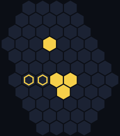

Forced win in 4 turns for the owner to move.
No reply within 5 cells holds (8646 tried): it wins with the opponent to move.

### U3 · contains a triangle

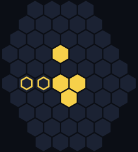

Forced win in 4 turns for the owner to move.
No reply within 5 cells holds (7260 tried): it wins with the opponent to move.

### U4 · Diamond (two triangles)


Forced win in 4 turns for the owner to move.
No reply within 5 cells holds (5995 tried): it wins with the opponent to move.

### U5 · contains 2 chevrons


Forced win in 4 turns for the owner to move.
No reply within 5 cells holds (6670 tried): it wins with the opponent to move.

### U6 · contains a chevron


Forced win in 4 turns for the owner to move.
No reply within 5 cells holds (7260 tried): it wins with the opponent to move.

### U7 · contains a chevron

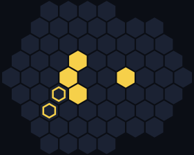

Forced win in 4 turns for the owner to move.
No reply within 5 cells holds (8646 tried): it wins with the opponent to move.

### U8

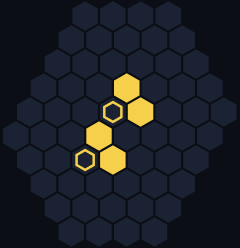

Forced win in 4 turns for the owner to move.
No reply within 5 cells holds (7381 tried): it wins with the opponent to move.

### U9


Forced win in 4 turns for the owner to move.
No reply within 5 cells holds (8128 tried): it wins with the opponent to move.

### U10

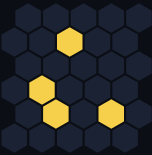

Forced win in 4 turns for the owner to move.
No reply within 5 cells holds (9045 tried): it wins with the opponent to move.

### U11

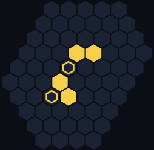

Forced win in 4 turns for the owner to move.
No reply within 5 cells holds (8128 tried): it wins with the opponent to move.

### U12

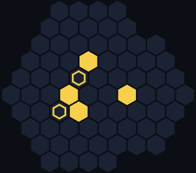

Forced win in 4 turns for the owner to move.
No reply within 5 cells holds (9591 tried): it wins with the opponent to move.

### U13


Forced win in 4 turns for the owner to move.
No reply within 5 cells holds (7260 tried): it wins with the opponent to move.

### U14

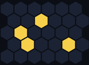

Forced win in 4 turns for the owner to move.
No reply within 5 cells holds (9591 tried): it wins with the opponent to move.

### U15

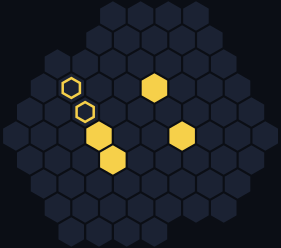

Forced win in 4 turns for the owner to move.
No reply within 5 cells holds (9591 tried): it wins with the opponent to move.

### U16

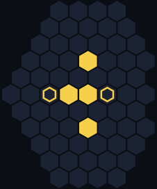

Forced win in 4 turns for the owner to move.
No reply within 5 cells holds (8646 tried): it wins with the opponent to move.

### U17


Forced win in 4 turns for the owner to move.
No reply within 5 cells holds (10153 tried): it wins with the opponent to move.

### U18


Forced win in 4 turns for the owner to move.
No reply within 5 cells holds (10585 tried): it wins with the opponent to move.

### U19

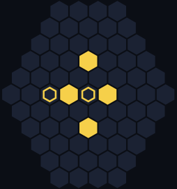

Forced win in 4 turns for the owner to move.
No reply within 5 cells holds (9045 tried): it wins with the opponent to move.

### U20 · contains a chevron


Forced win in 4 turns for the owner to move.
No reply within 5 cells holds (8515 tried): it wins with the opponent to move.

### U21 · contains 3 chevrons


Forced win in 4 turns for the owner to move.
No reply within 5 cells holds (7140 tried): it wins with the opponent to move.

## 3-stone must-answer shapes

All 16 of them, hardest to defend first. Every must-answer shape with more stones contains one of these or is listed below.

### A1 · Triangle

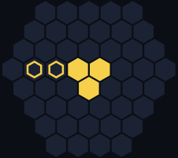

Forced win in 5 turns for the owner to move.
48 of 990 replies within 3 cells hold.

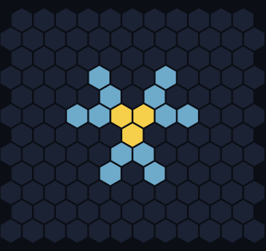

Defence map: the more holding replies use a cell, the bluer it is; no single cell is enough, both stones matter.

Some holding replies:

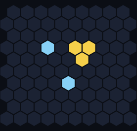 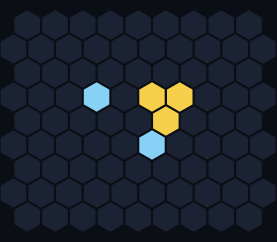 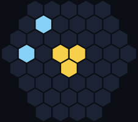 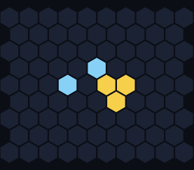

### A2 · Chevron (boomerang)

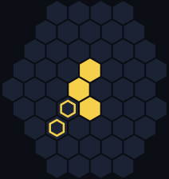

Forced win in 5 turns for the owner to move.
61 of 1128 replies within 3 cells hold.

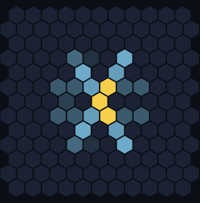

Defence map: the more holding replies use a cell, the bluer it is; no single cell is enough, both stones matter.

Some holding replies:

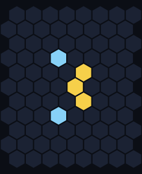 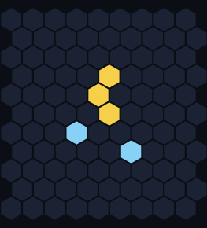 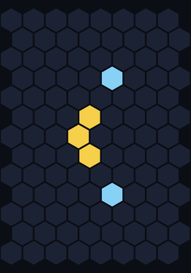 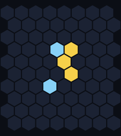

### A3

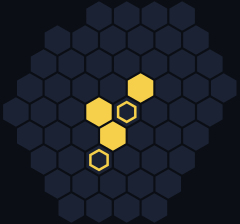

Forced win in 5 turns for the owner to move.
68 of 1326 replies within 3 cells hold.

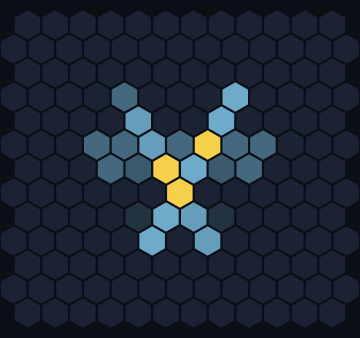

Defence map: the more holding replies use a cell, the bluer it is; no single cell is enough, both stones matter.

Some holding replies:

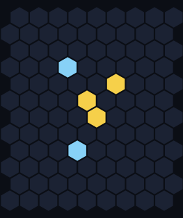 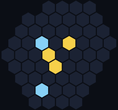 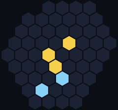 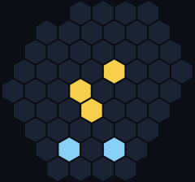

### A4

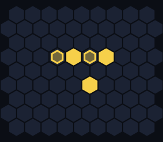

Forced win in 5 turns for the owner to move.
78 of 1596 replies within 3 cells hold.

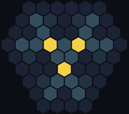

Defence map: the more holding replies use a cell, the bluer it is; no single cell is enough, both stones matter.

Some holding replies:

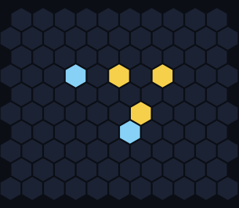 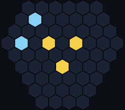 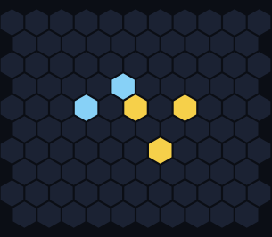 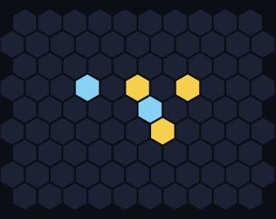

### A5

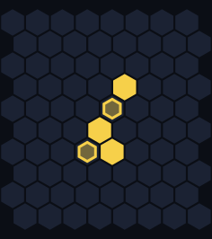

Forced win in 5 turns for the owner to move.
95 of 1485 replies within 3 cells hold.

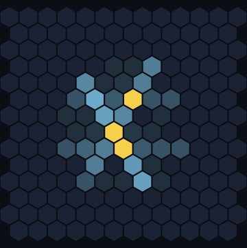

Defence map: the more holding replies use a cell, the bluer it is; no single cell is enough, both stones matter.

Some holding replies:

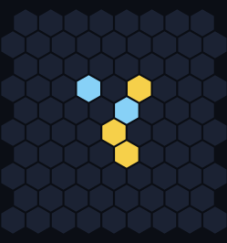 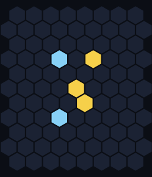 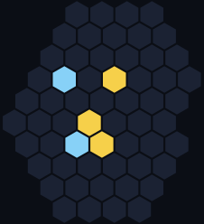 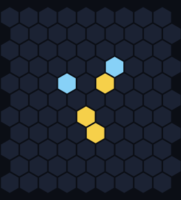

### A6

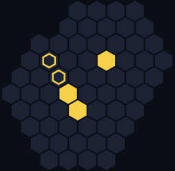

Forced win in 5 turns for the owner to move.
100 of 1711 replies within 3 cells hold.

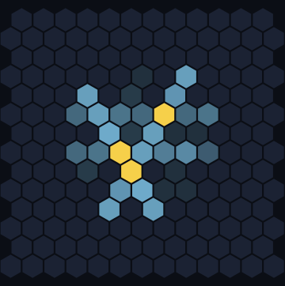

Defence map: the more holding replies use a cell, the bluer it is; no single cell is enough, both stones matter.

Some holding replies:

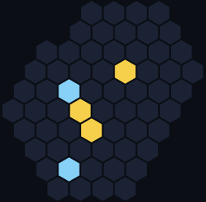 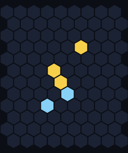 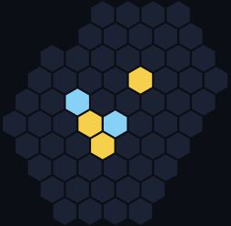 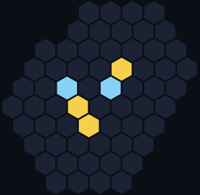

### A7

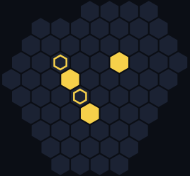

Forced win in 5 turns for the owner to move.
110 of 2016 replies within 3 cells hold.

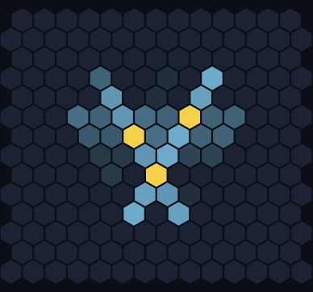

Defence map: the more holding replies use a cell, the bluer it is; no single cell is enough, both stones matter.

Some holding replies:

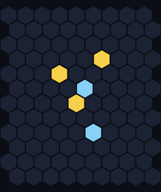   

### A8


Forced win in 5 turns for the owner to move.
126 of 2415 replies within 3 cells hold.


Defence map: the more holding replies use a cell, the bluer it is; no single cell is enough, both stones matter.

Some holding replies:

   

### A9


Forced win in 5 turns for the owner to move.
300 of 1431 replies within 3 cells hold.


Defence map: the more holding replies use a cell, the bluer it is; the 5 darkest cells hold whatever the second stone does.

Some holding replies:

   

### A10


Forced win in 5 turns for the owner to move.
321 of 1711 replies within 3 cells hold.


Defence map: the more holding replies use a cell, the bluer it is; the 5 darkest cells hold whatever the second stone does.

Some holding replies:

   

### A11


Forced win in 5 turns for the owner to move.
353 of 1711 replies within 3 cells hold.


Defence map: the more holding replies use a cell, the bluer it is; the 6 darkest cells hold whatever the second stone does.

Some holding replies:

   

### A12


Forced win in 5 turns for the owner to move.
602 of 1891 replies within 3 cells hold.


Defence map: the more holding replies use a cell, the bluer it is; the 10 darkest cells hold whatever the second stone does.

Some holding replies:

   

### A13


Forced win in 5 turns for the owner to move.
649 of 1830 replies within 3 cells hold.


Defence map: the more holding replies use a cell, the bluer it is; the 11 darkest cells hold whatever the second stone does.

Some holding replies:

   

### A14


Forced win in 5 turns for the owner to move.
660 of 1891 replies within 3 cells hold.


Defence map: the more holding replies use a cell, the bluer it is; the 11 darkest cells hold whatever the second stone does.

Some holding replies:

   

### A15


Forced win in 5 turns for the owner to move.
705 of 2145 replies within 3 cells hold.


Defence map: the more holding replies use a cell, the bluer it is; the 11 darkest cells hold whatever the second stone does.

Some holding replies:

   

### A16


Forced win in 5 turns for the owner to move.
1088 of 2346 replies within 3 cells hold.


Defence map: the more holding replies use a cell, the bluer it is; the 17 darkest cells hold whatever the second stone does.

Some holding replies:

   

## 4-stone must-answer shapes

The 61 minimal ones (they contain no 3-stone must-answer shape), hardest to defend first.

### B1


Forced win in 0 turns for the owner to move.
3 of 1431 replies within 3 cells hold.


Defence map: the more holding replies use a cell, the bluer it is; no single cell is enough, both stones matter.

Some holding replies:

 

### B2


Forced win in 0 turns for the owner to move.
61 of 1830 replies within 3 cells hold.


Defence map: the more holding replies use a cell, the bluer it is; the 1 darkest cells hold whatever the second stone does.

Some holding replies:

   

### B3


Forced win in 0 turns for the owner to move.
61 of 1830 replies within 3 cells hold.


Defence map: the more holding replies use a cell, the bluer it is; the 1 darkest cells hold whatever the second stone does.

Some holding replies:

   

### B4


Forced win in 0 turns for the owner to move.
133 of 2278 replies within 3 cells hold.


Defence map: the more holding replies use a cell, the bluer it is; the 2 darkest cells hold whatever the second stone does.

Some holding replies:

   

### B5


Forced win in 0 turns for the owner to move.
133 of 2278 replies within 3 cells hold.


Defence map: the more holding replies use a cell, the bluer it is; the 2 darkest cells hold whatever the second stone does.

Some holding replies:

   

### B6


Forced win in 0 turns for the owner to move.
133 of 2278 replies within 3 cells hold.


Defence map: the more holding replies use a cell, the bluer it is; the 2 darkest cells hold whatever the second stone does.

Some holding replies:

   

### B7


Forced win in 0 turns for the owner to move.
133 of 2278 replies within 3 cells hold.


Defence map: the more holding replies use a cell, the bluer it is; the 2 darkest cells hold whatever the second stone does.

Some holding replies:

   

### B8


Forced win in 4 turns for the owner to move.
177 of 2556 replies within 3 cells hold.


Defence map: the more holding replies use a cell, the bluer it is; the 1 darkest cells hold whatever the second stone does.

Some holding replies:

   

### B9


Forced win in 4 turns for the owner to move.
211 of 2926 replies within 3 cells hold.


Defence map: the more holding replies use a cell, the bluer it is; the 1 darkest cells hold whatever the second stone does.

Some holding replies:

   

### B10


Forced win in 4 turns for the owner to move.
320 of 2346 replies within 3 cells hold.


Defence map: the more holding replies use a cell, the bluer it is; the 4 darkest cells hold whatever the second stone does.

Some holding replies:

   

### B11


Forced win in 5 turns for the owner to move.
437 of 3655 replies within 3 cells hold.


Defence map: the more holding replies use a cell, the bluer it is; the 5 darkest cells hold whatever the second stone does.

Some holding replies:

   

### B12


Forced win in 4 turns for the owner to move.
465 of 2415 replies within 3 cells hold.


Defence map: the more holding replies use a cell, the bluer it is; the 7 darkest cells hold whatever the second stone does.

Some holding replies:

   

### B13


Forced win in 5 turns for the owner to move.
475 of 2926 replies within 3 cells hold.


Defence map: the more holding replies use a cell, the bluer it is; the 5 darkest cells hold whatever the second stone does.

Some holding replies:

   

### B14


Forced win in 4 turns for the owner to move.
478 of 2556 replies within 3 cells hold.


Defence map: the more holding replies use a cell, the bluer it is; the 7 darkest cells hold whatever the second stone does.

Some holding replies:

   

### B15


Forced win in 4 turns for the owner to move.
507 of 2775 replies within 3 cells hold.


Defence map: the more holding replies use a cell, the bluer it is; the 7 darkest cells hold whatever the second stone does.

Some holding replies:

   

### B16


Forced win in 5 turns for the owner to move.
529 of 3403 replies within 3 cells hold.


Defence map: the more holding replies use a cell, the bluer it is; the 5 darkest cells hold whatever the second stone does.

Some holding replies:

   

### B17


Forced win in 5 turns for the owner to move.
549 of 3486 replies within 3 cells hold.


Defence map: the more holding replies use a cell, the bluer it is; the 5 darkest cells hold whatever the second stone does.

Some holding replies:

   

### B18


Forced win in 4 turns for the owner to move.
586 of 2850 replies within 3 cells hold.


Defence map: the more holding replies use a cell, the bluer it is; the 8 darkest cells hold whatever the second stone does.

Some holding replies:

   

### B19


Forced win in 4 turns for the owner to move.
586 of 2850 replies within 3 cells hold.


Defence map: the more holding replies use a cell, the bluer it is; the 8 darkest cells hold whatever the second stone does.

Some holding replies:

   

### B20


Forced win in 4 turns for the owner to move.
586 of 2926 replies within 3 cells hold.


Defence map: the more holding replies use a cell, the bluer it is; the 8 darkest cells hold whatever the second stone does.

Some holding replies:

   

### B21


Forced win in 5 turns for the owner to move.
591 of 4095 replies within 3 cells hold.


Defence map: the more holding replies use a cell, the bluer it is; the 5 darkest cells hold whatever the second stone does.

Some holding replies:

   

### B22


Forced win in 5 turns for the owner to move.
595 of 4005 replies within 3 cells hold.


Defence map: the more holding replies use a cell, the bluer it is; the 5 darkest cells hold whatever the second stone does.

Some holding replies:

   

### B23


Forced win in 5 turns for the owner to move.
611 of 2556 replies within 3 cells hold.


Defence map: the more holding replies use a cell, the bluer it is; the 9 darkest cells hold whatever the second stone does.

Some holding replies:

   

### B24


Forced win in 4 turns for the owner to move.
614 of 3081 replies within 3 cells hold.


Defence map: the more holding replies use a cell, the bluer it is; the 8 darkest cells hold whatever the second stone does.

Some holding replies:

   

### B25


Forced win in 4 turns for the owner to move.
623 of 2926 replies within 3 cells hold.


Defence map: the more holding replies use a cell, the bluer it is; the 6 darkest cells hold whatever the second stone does.

Some holding replies:

   

### B26


Forced win in 5 turns for the owner to move.
644 of 4278 replies within 3 cells hold.


Defence map: the more holding replies use a cell, the bluer it is; the 6 darkest cells hold whatever the second stone does.

Some holding replies:

   

### B27


Forced win in 5 turns for the owner to move.
655 of 4656 replies within 3 cells hold.


Defence map: the more holding replies use a cell, the bluer it is; the 5 darkest cells hold whatever the second stone does.

Some holding replies:

   

### B28


Forced win in 5 turns for the owner to move.
673 of 4753 replies within 3 cells hold.


Defence map: the more holding replies use a cell, the bluer it is; the 6 darkest cells hold whatever the second stone does.

Some holding replies:

   

### B29


Forced win in 4 turns for the owner to move.
679 of 2556 replies within 3 cells hold.


Defence map: the more holding replies use a cell, the bluer it is; the 10 darkest cells hold whatever the second stone does.

Some holding replies:

   

### B30


Forced win in 5 turns for the owner to move.
717 of 2556 replies within 3 cells hold.


Defence map: the more holding replies use a cell, the bluer it is; the 10 darkest cells hold whatever the second stone does.

Some holding replies:

   

### B31


Forced win in 5 turns for the owner to move.
745 of 3081 replies within 3 cells hold.


Defence map: the more holding replies use a cell, the bluer it is; the 10 darkest cells hold whatever the second stone does.

Some holding replies:

   

### B32


Forced win in 5 turns for the owner to move.
807 of 3081 replies within 3 cells hold.


Defence map: the more holding replies use a cell, the bluer it is; the 10 darkest cells hold whatever the second stone does.

Some holding replies:

   

### B33


Forced win in 5 turns for the owner to move.
818 of 3655 replies within 3 cells hold.


Defence map: the more holding replies use a cell, the bluer it is; the 10 darkest cells hold whatever the second stone does.

Some holding replies:

   

### B34


Forced win in 4 turns for the owner to move.
836 of 3003 replies within 3 cells hold.


Defence map: the more holding replies use a cell, the bluer it is; the 11 darkest cells hold whatever the second stone does.

Some holding replies:

   

### B35


Forced win in 5 turns for the owner to move.
841 of 3321 replies within 3 cells hold.


Defence map: the more holding replies use a cell, the bluer it is; the 9 darkest cells hold whatever the second stone does.

Some holding replies:

   

### B36


Forced win in 5 turns for the owner to move.
841 of 3321 replies within 3 cells hold.


Defence map: the more holding replies use a cell, the bluer it is; the 9 darkest cells hold whatever the second stone does.

Some holding replies:

   

### B37


Forced win in 5 turns for the owner to move.
868 of 3081 replies within 3 cells hold.


Defence map: the more holding replies use a cell, the bluer it is; the 11 darkest cells hold whatever the second stone does.

Some holding replies:

   

### B38


Forced win in 4 turns for the owner to move.
877 of 2556 replies within 3 cells hold.


Defence map: the more holding replies use a cell, the bluer it is; the 13 darkest cells hold whatever the second stone does.

Some holding replies:

   

### B39


Forced win in 5 turns for the owner to move.
887 of 3655 replies within 3 cells hold.


Defence map: the more holding replies use a cell, the bluer it is; the 10 darkest cells hold whatever the second stone does.

Some holding replies:

   

### B40


Forced win in 5 turns for the owner to move.
900 of 4278 replies within 3 cells hold.


Defence map: the more holding replies use a cell, the bluer it is; the 10 darkest cells hold whatever the second stone does.

Some holding replies:

   

### B41


Forced win in 4 turns for the owner to move.
908 of 3160 replies within 3 cells hold.


Defence map: the more holding replies use a cell, the bluer it is; the 12 darkest cells hold whatever the second stone does.

Some holding replies:

   

### B42


Forced win in 5 turns for the owner to move.
969 of 3403 replies within 3 cells hold.


Defence map: the more holding replies use a cell, the bluer it is; the 12 darkest cells hold whatever the second stone does.

Some holding replies:

   

### B43


Forced win in 5 turns for the owner to move.
982 of 2775 replies within 3 cells hold.


Defence map: the more holding replies use a cell, the bluer it is; the 14 darkest cells hold whatever the second stone does.

Some holding replies:

   

### B44


Forced win in 4 turns for the owner to move.
1037 of 3828 replies within 3 cells hold.


Defence map: the more holding replies use a cell, the bluer it is; the 12 darkest cells hold whatever the second stone does.

Some holding replies:

   

### B45


Forced win in 5 turns for the owner to move.
1078 of 4656 replies within 3 cells hold.


Defence map: the more holding replies use a cell, the bluer it is; the 11 darkest cells hold whatever the second stone does.

Some holding replies:

   

### B46


Forced win in 4 turns for the owner to move.
1083 of 2775 replies within 3 cells hold.


Defence map: the more holding replies use a cell, the bluer it is; the 16 darkest cells hold whatever the second stone does.

Some holding replies:

   

### B47


Forced win in 5 turns for the owner to move.
1126 of 4753 replies within 3 cells hold.


Defence map: the more holding replies use a cell, the bluer it is; the 11 darkest cells hold whatever the second stone does.

Some holding replies:

   

### B48


Forced win in 5 turns for the owner to move.
1169 of 2775 replies within 3 cells hold.


Defence map: the more holding replies use a cell, the bluer it is; the 17 darkest cells hold whatever the second stone does.

Some holding replies:

   

### B49


Forced win in 6 turns for the owner to move.
1225 of 3321 replies within 3 cells hold.


Defence map: the more holding replies use a cell, the bluer it is; the 16 darkest cells hold whatever the second stone does.

Some holding replies:

   

### B50


Forced win in 4 turns for the owner to move.
1264 of 3321 replies within 3 cells hold.


Defence map: the more holding replies use a cell, the bluer it is; the 17 darkest cells hold whatever the second stone does.

Some holding replies:

   

### B51


Forced win in 5 turns for the owner to move.
1313 of 3081 replies within 3 cells hold.


Defence map: the more holding replies use a cell, the bluer it is; the 18 darkest cells hold whatever the second stone does.

Some holding replies:

   

### B52


Forced win in 5 turns for the owner to move.
1331 of 3570 replies within 3 cells hold.


Defence map: the more holding replies use a cell, the bluer it is; the 17 darkest cells hold whatever the second stone does.

Some holding replies:

   

### B53


Forced win in 6 turns for the owner to move.
1343 of 3916 replies within 3 cells hold.


Defence map: the more holding replies use a cell, the bluer it is; the 16 darkest cells hold whatever the second stone does.

Some holding replies:

   

### B54


Forced win in 5 turns for the owner to move.
1422 of 3486 replies within 3 cells hold.


Defence map: the more holding replies use a cell, the bluer it is; the 18 darkest cells hold whatever the second stone does.

Some holding replies:

   

### B55


Forced win in 5 turns for the owner to move.
1497 of 3403 replies within 3 cells hold.


Defence map: the more holding replies use a cell, the bluer it is; the 19 darkest cells hold whatever the second stone does.

Some holding replies:

   

### B56


Forced win in 5 turns for the owner to move.
1579 of 3321 replies within 3 cells hold.


Defence map: the more holding replies use a cell, the bluer it is; the 21 darkest cells hold whatever the second stone does.

Some holding replies:

   

### B57


Forced win in 6 turns for the owner to move.
1630 of 4278 replies within 3 cells hold.


Defence map: the more holding replies use a cell, the bluer it is; the 18 darkest cells hold whatever the second stone does.

Some holding replies:

   

### B58


Forced win in 5 turns for the owner to move.
1648 of 4005 replies within 3 cells hold.


Defence map: the more holding replies use a cell, the bluer it is; the 19 darkest cells hold whatever the second stone does.

Some holding replies:

   

### B59


Forced win in 5 turns for the owner to move.
1817 of 5356 replies within 3 cells hold.


Defence map: the more holding replies use a cell, the bluer it is; the 17 darkest cells hold whatever the second stone does.

Some holding replies:

   

### B60


Forced win in 6 turns for the owner to move.
1892 of 4753 replies within 3 cells hold.


Defence map: the more holding replies use a cell, the bluer it is; the 20 darkest cells hold whatever the second stone does.

Some holding replies:

   

### B61


Forced win in 6 turns for the owner to move.
2031 of 5356 replies within 3 cells hold.


Defence map: the more holding replies use a cell, the bluer it is; the 20 darkest cells hold whatever the second stone does.

Some holding replies:

   

## 5-stone must-answer shapes

The 196 minimal ones. They're spread out: every tighter 5-stone must-answer shape contains a smaller one above.

                                                                                                                                                                                                   

## What this doesn't cover

- **Wins that need a quiet move.** The solver only proves wins where every turn forces the opponent. Some shapes are probably still winning with a slower, non-forcing move first: the straight three (three in a row), for example, has no forcing win for the owner to move, but Six's deeper search thinks the owner wins. Those aren't listed as must-answer here, because that kind of win can't be proven the same way.
- **Shapes near other stones.** Every shape here stands alone. In a real game, the opponent's own threats (a counter-threat while defending) and other stones change everything.
- **Spread-out shapes.** Stones more than 2 cells apart only count as one shape when they share a line within 4 cells.

## Rebuilding this page

```bash
engine/build/release/sixshapes --stones 4 --defend 4 > runs/shapes/s4d.jsonl
engine/build/release/sixshapes --stones 5 --defend 0 > runs/shapes/s5.jsonl
python guide/make_shapes.py runs/shapes/s4d.jsonl runs/shapes/s5.jsonl
```

