# Shapes that win

Every small shape of one player's stones, checked by the forced-win solver in Six (the bot in this repository): which ones you must answer, the replies that work, and the ones that can't be answered at all. The full lists are in the [catalogue](shapes-catalog.md).

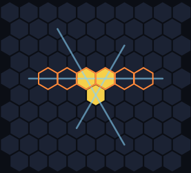

**The game:** X opens with one stone, then each player places two stones a turn; six in a row wins. Every threat lives in a **window of six** cells in a row (orange), and a **four** (four of your stones in one window, none of the opponent's) threatens six next turn.

**Tempo:** some fours take one stone to block, others (like four in a row with open ends) take both. A defender who spends both stones builds nothing. A win is a turn whose threats take three or more stones to block, reached by fours that take both stones every turn before it.

**Words:** a **shape** is some of one player's stones with nothing else nearby; stones belong to one shape when they're within 2 cells, or on one line within 4, close enough to share a window of six (rotations and mirror images count as the same shape). A shape is **must-answer** if its owner, moving next, wins by threats alone; a reply **holds** if the solver then finds no such win (replies within 3 cells were tried). **Tight** and **loose** threes and **close pairs** are defined below as they come up.

**On this page:** [In short](#in-short) · [Using this in a game](#using-this-in-a-game) · [Fours](#fours) · [Close pairs](#close-pairs) · [Cheat sheet](#cheat-sheet) · [Attacking](#attacking) · [Worked examples](#worked-examples) · [Unstoppable shapes](#unstoppable-shapes) · [Test yourself](#test-yourself)

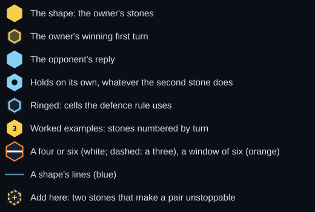

## In short

- **Must-answer three** (its owner, to move, wins by threats alone) → **answer it this turn with the cheat-sheet reply.**
- **Tight three** (triangle or chevron, no two stones more than 3 apart; A1–A8) → **one stone on each of two of its lines (blue), both within 2 cells of it.** Every such pair holds.
- **Loose three** (any other must-answer three; A9–A16) → **one stone on one of its lines, in a gap or within 2 cells of its stones.** The other stone isn't needed against the threats: put it next to the shape's close pair, or attack.
- **Four** → **block it now**: one stone in its gap, or both ends if it's solid.
- **Close pair** (two stones within 2 cells, or 3 apart on one line) → **needs an answer too: your stones near it.** In open space, two more stones make any close pair unstoppable.
- **21 unstoppable 4-stone shapes** win even when the opponent moves first. Each holds two or more tight threes, though that alone isn't enough.

## Using this in a game

Each turn, in this order:

1. **Can you make six?** Do it.
2. **Does the opponent have a four?** Block it (see [Fours](#fours)). A block that also makes your own four is best.
3. **Can you force a win?** You need a four that takes both of their stones every turn, until one turn's threats take three stones to block (see the [worked example](#worked-examples)).
4. **Does the opponent have a must-answer shape?** Check their two new stones and anything of theirs within 5 cells (a window of six spans 5 steps). Threes: the [cheat sheet](#cheat-sheet). Four-stone clusters: most are must-answer, so treat them as urgent (the ones with no must-answer three inside are in the [catalogue](shapes-catalog.md)). Only skip this if step 3 wins first: an unstoppable shape of yours doesn't stop their fours.
5. **Do you have a close pair in open space?** Add the two stones (+) that make it an unstoppable shape (see [Close pairs](#close-pairs)).
6. **Does the opponent have a close pair in open space?** Take its two ringed cells (see [Close pairs](#close-pairs)). With two such pairs, answer neighbours or a one-gap pair first (a rule of thumb: they have the most ways to finish).
7. **Otherwise, [attack](#attacking).**

**Must-answer** needs a specific reply now (the cheat sheet); a **close pair** needs stones of yours near it (see Close pairs). Nearly every enemy cluster needs one or the other.

Definitions and details

<table><tr><td align="center">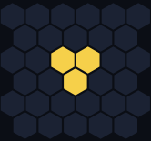 Triangle 1+1</td><td align="center">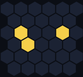 Triangle 1+3</td><td align="center"> Chevron 1+1</td><td align="center">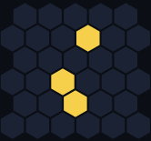 Chevron 1+2</td><td align="center">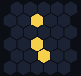 Pair + 1 (2,3)</td></tr></table>

Names: the numbers are how far the two outer stones are from the corner stone. A triangle's lines meet at 60°, a chevron's at 120°.

- **Holds:** after the reply, the solver finds no forced win. That stops the forced win; it doesn't make the position safe.
- 16 of the 41 three-stone shapes are must-answer. Against a tight three, only about 5% of all replies hold.
- The two-lines defence works for all 11 threes with two or more lines (A1–A11); against the classic triangle, those pairs are the only replies that hold.
- The loose-three rule works for every loose three; some also hold with one stone on other cells (extra cells: A9 1, A11 6, A12 1, A14 6, A16 5).
- The other 25 threes aren't must-answer, but 22 of them contain a close pair that can grow into an unstoppable shape.
- All 7 four-stone shapes in which every three stones form a tight three are unstoppable.
- **Within 2 cells:** at most 2 steps across the hex grid.
- **Lines of a shape:** the lines through two of its stones. The triangle 1+1 has three.
- **Triangle a+b, chevron a+b:** two stones on two different lines from a corner stone, a and b cells away. The lines meet at 60° in a triangle and 120° in a chevron; only the equal triangles (1+1, 2+2, 3+3) close into a full triangle. The classic triangle and chevron (boomerang) are both 1+1.
- **Pair + 1 (2,3):** a pair plus a third stone 2 and 3 cells from the two; a split pair has one cell between its stones, a wide pair two.

## Fours

Four stones in one window of six threaten six next turn. With a gap, one stone on a dotted cell holds; the solid four needs both stones (only 3 replies hold, one shown).

<table><tr>
<td align="center">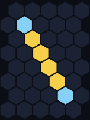 <b>F1</b> both stones</td>
<td align="center">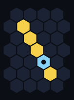 <b>F2</b> 1 stone in a gap</td>
<td align="center">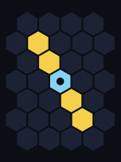 <b>F3</b> 1 stone in a gap</td>
<td align="center">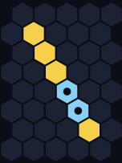 <b>F4</b> 1 stone in a gap</td>
</tr><tr><td align="center">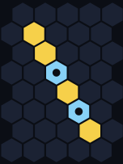 <b>F5</b> 1 stone in a gap</td>
<td align="center">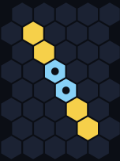 <b>F6</b> 1 stone in a gap</td>
<td align="center">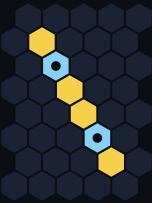 <b>F7</b> 1 stone in a gap</td>
</tr></table>

## Close pairs

Each close pair becomes an [unstoppable shape](#unstoppable-shapes) with two more stones; one way is marked (+). Two stones 4 apart on a line never do, so they aren't a close pair.

<table><tr>
<td align="center">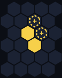 <b>Neighbours</b> add these two → <a href="#unstoppable-shapes">U1 (diamond)</a></td>
<td align="center"> <b>One-gap pair</b> add these two → <a href="#unstoppable-shapes">U2</a></td>
<td align="center">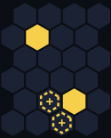 <b>Two-gap pair</b> add these two → <a href="shapes-catalog.md#unstoppable-shapes">U11</a></td>
<td align="center"> <b>Off-line pair</b> add these two → <a href="#unstoppable-shapes">U1 (diamond)</a></td>
</tr><tr>
<td align="center"> your answer: these two (or their mirror image)</td>
<td align="center">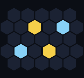 your answer: these two (or their mirror image)</td>
<td align="center">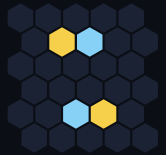 your answer: these two (or their mirror image)</td>
<td align="center"> your answer: these two (or their mirror image)</td>
</tr><tr>
<td align="center">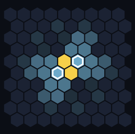 stones on the two ringed cells take away 29 of its 89 ways; the other 60 can all be held</td>
<td align="center">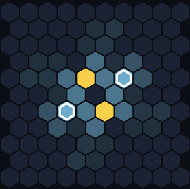 stones on the two ringed cells take away 29 of its 73 ways; the other 44 can all be held</td>
<td align="center">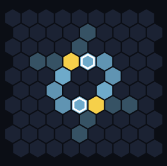 stones on the two ringed cells take away 12 of its 30 ways; the other 18 can all be held</td>
<td align="center">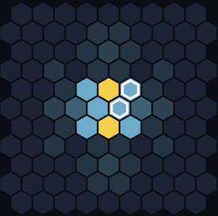 stones on the two ringed cells take away 18 of its 45 ways; the other 27 can all be held</td>
</tr></table>

The maps show the cells the owner can finish with (bluer = more ways). **Two stones on the ringed cells are enough to stop it becoming unstoppable:** they take away about a third of the ways outright, and the solver checked every other way with those two stones on the board and found a reply that holds each time (replies within 3 cells). The owner can still build threats later; this only removes the sure win. So answer an opponent's close pair in open space with the ringed cells, and don't leave your own pairs where they can be answered this way before you use them.

## Cheat sheet

**Tight threes: two stones, one on each of two different ringed lines.** Any rotation or mirror image works the same way.

<table><tr><td align="center">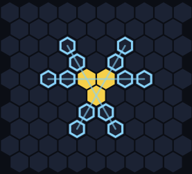 <b>A1</b> · Triangle 1+1 3 lines: pick any two</td><td align="center">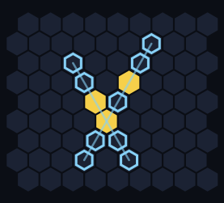 <b>A2</b> · Triangle 1+2 2 lines: one stone on each</td><td align="center">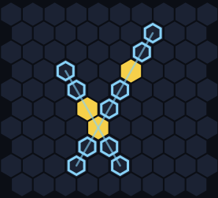 <b>A3</b> · Triangle 1+3 2 lines: one stone on each</td><td align="center">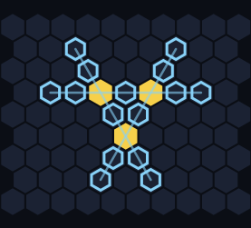 <b>A4</b> · Triangle 2+2 3 lines: pick any two</td></tr><tr><td align="center">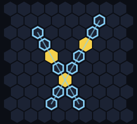 <b>A5</b> · Triangle 2+3 2 lines: one stone on each</td><td align="center">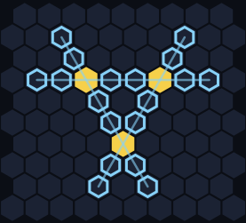 <b>A6</b> · Triangle 3+3 3 lines: pick any two</td><td align="center">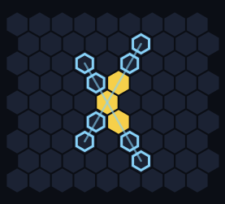 <b>A7</b> · Chevron 1+1 2 lines: one stone on each</td><td align="center">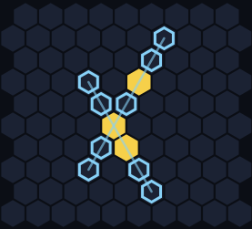 <b>A8</b> · Chevron 1+2 2 lines: one stone on each</td></tr></table>

**Loose threes: one stone on any dotted cell.** The ringed ones are the rule's cells; every dotted cell works.

<table><tr><td align="center">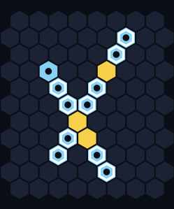 <b>A9</b> · Chevron 1+3 11 one-stone cells</td><td align="center">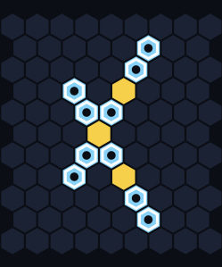 <b>A10</b> · Chevron 2+2 10 one-stone cells</td><td align="center">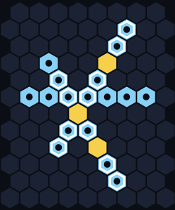 <b>A11</b> · Chevron 2+3 17 one-stone cells</td><td align="center">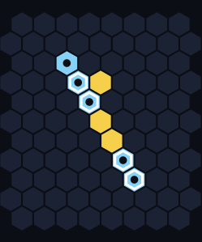 <b>A12</b> · Pair + 1 (2,3) 5 one-stone cells</td></tr><tr><td align="center">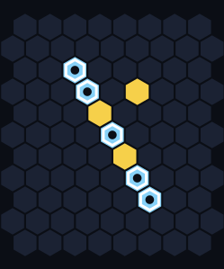 <b>A13</b> · Split pair + 1 (2,3) 5 one-stone cells</td><td align="center">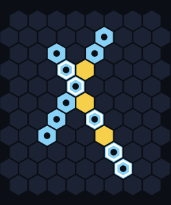 <b>A14</b> · Split pair + 1 (2,4) 11 one-stone cells</td><td align="center">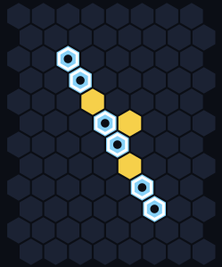 <b>A15</b> · Wide pair + 1 (2,2) 6 one-stone cells</td><td align="center">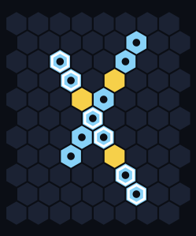 <b>A16</b> · Wide pair + 1 (2,4) 11 one-stone cells</td></tr></table>

Defence maps and every holding reply are in the [catalogue](shapes-catalog.md#3-stone-must-answer-shapes).

## Attacking

- **Finish a close pair in open space.** If the opponent leaves one of your close pairs alone, the two (+) stones in [Close pairs](#close-pairs) make an unstoppable shape.
- **Turn a close pair into a tight three.** One stone does it (+ makes the triangle). The opponent must answer with both stones, and your other stone is free to build somewhere else.
- **Keep fours coming.** A four that takes both stones every turn leaves the opponent no time, as in the worked example below.
- **Three in a window plus one.** Three of your stones in one window of six with a fourth stone off that line is often must-answer (14 minimal patterns in the catalogue). One of them, with the winning first turn outlined:

<table><tr><td align="center">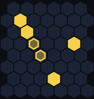 the outlined turn makes a four (five stones in the window); six on turn 6</td></tr></table>

The three by itself isn't must-answer. The catalogue has all of them, with every holding reply, under [a three plus one](shapes-catalog.md#4-stones-a-three-plus-one).

## Worked examples

Numbers are turns: a yellow n is X's turn n, and a blue n is O's answer to it. Each picture shows X's new stones and O's latest block bright, older stones dim, and the starting shape bright. Each block is the toughest one the solver found.

### How the triangle wins (A1)

<table><tr><td align="center" valign="top">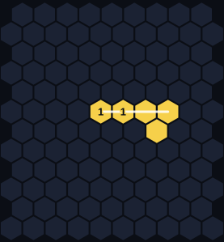 X1: a four · horizontal line</td><td align="center" valign="top">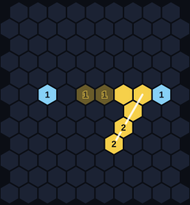 X2: a four · up-right diagonal</td><td align="center" valign="top">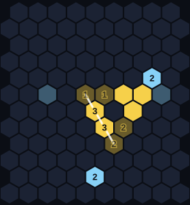 X3: a four · down-right diagonal</td></tr><tr><td align="center" valign="top">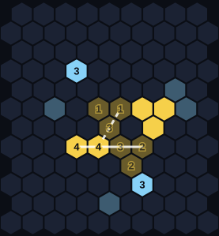 X4: a four and a new three (dashed) · horizontal line</td><td align="center" valign="top">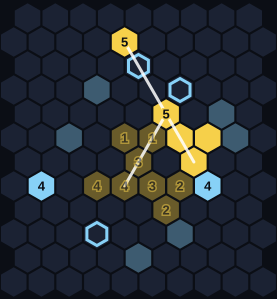 X5: blocking takes 3 stones (one way ringed)</td><td align="center" valign="top">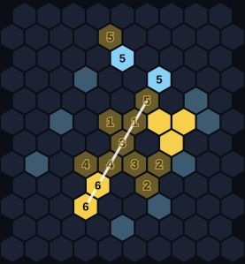 X6: six in a row</td></tr></table>

Every turn is a four that takes both of O's stones, so O never builds anything. On turn 5 the threats need three stones to block, and O has two. The key move is X4: its four also lines up three stones on a second line, which becomes part of the unstoppable threats on turn 5.

Turn by turn

1. **X1:** a four on the horizontal line: 2 stones already there plus two new ones. It takes both of O's stones to block.
2. **X2:** another four (up-right diagonal), another two stones for O.
3. **X3:** another four (down-right diagonal), another two stones for O.
4. **X4:** another four (horizontal line), another two stones for O. It also lines up three on the up-right diagonal.
5. **X5:** threats on two lines: the down-right diagonal takes 1 stone and the up-right diagonal takes 2 stones to block. That's more than O's two stones.
6. **X6:** six in a row.

### Defending the triangle (A1)

<table><tr><td align="center">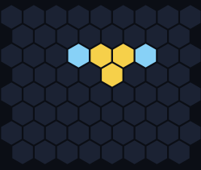 Both ends of one line: loses</td><td align="center">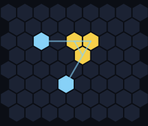 One stone on each of two lines: holds</td></tr></table>

Blocking both ends of one line looks solid, but it leaves the triangle's other two lines untouched, and X still wins with a four every turn. One stone on each of two lines cuts two of the three lines at once, and the solver finds no win after it. After the losing reply, X makes six on turn 6.

Turn by turn after the reply

<table><tr><td align="center" valign="top">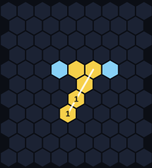 X1: a four · up-right diagonal</td><td align="center" valign="top">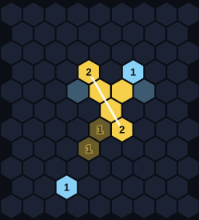 X2: a four · down-right diagonal</td><td align="center" valign="top">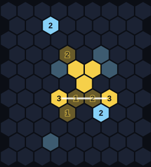 X3: a four · horizontal line</td></tr><tr><td align="center" valign="top">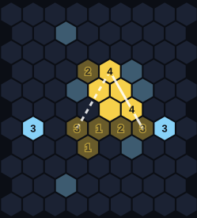 X4: a four and a new three (dashed) · down-right diagonal</td><td align="center" valign="top"> X5: blocking takes 4 stones (one way ringed)</td><td align="center" valign="top"> X6: six in a row</td></tr></table>

1. **X1:** a four on the up-right diagonal: 2 stones already there plus two new ones. It takes both of O's stones to block.
2. **X2:** another four (down-right diagonal), another two stones for O.
3. **X3:** another four (horizontal line), another two stones for O.
4. **X4:** another four (down-right diagonal), another two stones for O. It also lines up three on the up-right diagonal.
5. **X5:** threats on two lines: the up-right diagonal takes 2 stones and the horizontal line takes 2 stones to block. That's more than O's two stones.
6. **X6:** six in a row.

## Unstoppable shapes

21 four-stone shapes win even with the opponent to move: the solver tried every two-stone reply within 5 cells of each (about 6,000 to 10,600 replies) and none holds. You'll rarely meet one finished; it appears in one turn when a close pair gets two free stones. Two tight threes inside aren't enough on their own: 45 other four-stone shapes have two or more and can still be held, so learn these shapes rather than a rule. The four most compact (the rest are in the [catalogue](shapes-catalog.md#unstoppable-shapes)):

<table><tr><td align="center"> <b>U1</b> · Diamond (two triangles) 4 tight threes inside</td><td align="center"> <b>U2</b> 4 tight threes inside</td><td align="center"> <b>U3</b> 3 tight threes inside</td><td align="center"> <b>U4</b> 3 tight threes inside</td></tr></table>

### Why the diamond (U1) can't be stopped

<table><tr><td align="center"> The two-lines defence on one of its triangles</td></tr></table>

The diamond is two triangles sharing a side. The defence that stops a lone triangle doesn't stop both: X still makes a four every turn and six on the last. After the losing reply, X makes six on turn 5.

Turn by turn after the reply

<table><tr><td align="center" valign="top"> X1: a four · up-right diagonal</td><td align="center" valign="top"> X2: a four and a new three (dashed) · horizontal line</td><td align="center" valign="top"> X3: a four and a new three (dashed) · down-right diagonal</td></tr><tr><td align="center" valign="top"> X4: blocking takes 4 stones (one way ringed)</td><td align="center" valign="top"> X5: six in a row</td></tr></table>

1. **X1:** a four on the up-right diagonal: 2 stones already there plus two new ones. It takes both of O's stones to block.
2. **X2:** another four (horizontal line), another two stones for O. It also lines up three on the down-right diagonal.
3. **X3:** another four (down-right diagonal), another two stones for O. It also lines up three on the up-right diagonal.
4. **X4:** threats on two lines: the down-right diagonal takes 2 stones and the up-right diagonal takes 2 stones to block. That's more than O's two stones.
5. **X5:** six in a row.

## Test yourself

The answer is folded under each question.

**1. A7 · Chevron 1+1: which reply holds?**

<table><tr><td align="center"> <b>A</b></td><td align="center"> <b>B</b></td></tr></table>

Answer

**B** holds: one stone on each of two of its lines, both within 2 cells. The other reply looks the same, but one stone is 3 cells out, too far to stop the fours.

After the other reply, X wins starting here (outlined), with six on turn 6. The ringed stone is the one that's too far out.

**2. A9 · Chevron 1+3: which reply holds?**

<table><tr><td align="center"> <b>A</b></td><td align="center"> <b>B</b></td></tr></table>

Answer

**A** holds: one stone in a gap on one of its lines is enough. The other reply hugs the shape and looks solid, but neither stone is on any of the shape's lines.

After the other reply, X wins starting here (outlined), with six on turn 6.

**3. F1 · solid four: which reply holds?**

<table><tr><td align="center"> <b>A</b></td><td align="center"> <b>B</b></td></tr></table>

Answer

**B** holds: a solid four needs a stone at each end; it's one of only 3 replies that hold. Two stones at one end leave the other end open.

After the other reply, X makes six right away (outlined).

**4. Which one needs the cheat-sheet reply right now?**

<table><tr><td align="center"> <b>A</b></td><td align="center"> <b>B</b></td></tr></table>

Answer

**B**, the triangle 1+3 (A3): its owner wins by threats alone if you don't. Three in a row has no such win; treat it as close pairs: take the ringed cells of its most dangerous pair (neighbours first).

The cheat-sheet reply for B: one stone on each of two of its lines.

**5. Left alone in open space, which pair can't become an unstoppable shape?**

<table><tr><td align="center"> <b>A</b></td><td align="center"> <b>B</b></td></tr></table>

Answer

**B**: stones 4 apart on a line aren't a close pair, and they never become an unstoppable shape. The one-gap pair (A) becomes one with two more stones (+):

## What this doesn't cover

- **Shapes near other stones.** Every shape here stands alone. In a real game the opponent's own threats (a counter-four while defending) and other stones change things.
- **Threes that aren't must-answer.** Answering their most dangerous pair with that pair's ringed cells is a rule of thumb; the solver check covered pairs on their own, not inside a three.
- **Quiet wins.** Must-answer means a win by threats alone. A shape without one, like three in a row, can still win with a free turn (see [Close pairs](#close-pairs)).
- **Bigger shapes.** The [catalogue](shapes-catalog.md) lists 54 more 4-stone shapes (not fours) and 196 5-stone shapes that are must-answer and contain no smaller must-answer shape.

