# Shapes that win

Every small shape of one player's stones, checked by the forced-win solver in Six (the bot in this repository): which ones you must answer, the replies that work, and the ones that can't be answered at all. The full lists are in the [catalogue](shapes-catalog.md).

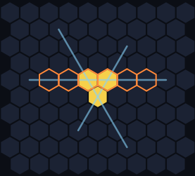

**The game:** X opens with one stone, then each player places two stones a turn; six in a row wins. Every threat lives in a **window of six** cells in a row (orange), and a **four** (four of your stones in one window, none of the opponent's) threatens six next turn.

**Tempo:** some fours take one stone to block, others (like four in a row with open ends) take both. A defender who spends both stones builds nothing. A **forced win** is a four every turn that takes both stones (a **double threat**), until one turn's threats take three or more stones to block. A **non-forced win** also needs at least one turn that isn't a double threat: a **quiet move** (no four, or a four one stone can block).

**Key words:** a shape is **must-answer** if its owner, moving next, has a forced win; your reply **holds** if the solver then finds no forced win; a shape is **unstoppable** if it wins even when you move first.

More words

A **shape** is some of one player's stones with nothing else nearby; stones belong to one shape when they're within 2 cells (at most 2 steps across the grid) or on one line within 4 (so they share a window of six with room to spare); rotations and mirror images count as the same shape. The **lines** of a shape are the lines through two or more of its stones. Replies within 3 cells were tried for **holds**; holding stops the forced win, it doesn't make the position safe. **Open space** means no other stones nearby: every shape here was checked alone on the board. **Two-stone** and **one-stone** threes and **close pairs** are defined below.

**On this page:** [In short](#in-short) · [Using this in a game](#using-this-in-a-game) · [Fours](#fours) · [Close pairs](#close-pairs) · [Cheat sheet](#cheat-sheet) · [Attacking](#attacking) · [Worked examples](#worked-examples) · [Unstoppable shapes](#unstoppable-shapes) · [Test yourself](#test-yourself)

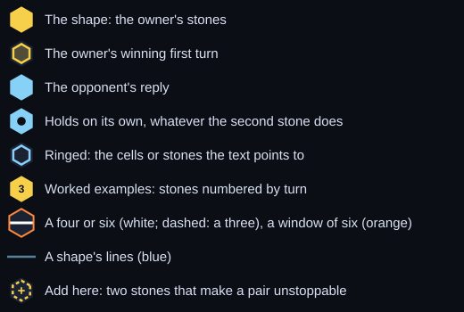

## In short

- **Must-answer three** (its owner, to move, has a forced win) → **answer it this turn with the cheat-sheet reply.** If it's part of a four-stone shape, use step 4's quick rule or look the shape up in the [catalogue](shapes-catalog.md).
- **Two-stone three** (your answer takes both stones; a triangle or chevron with no two stones more than 3 apart; A1–A8) → **one stone on each of two of its lines (blue), both within 2 cells of it.** Every such pair holds.
- **One-stone three** (one of your stones is enough; every other must-answer three; A9–A18) → **one stone on one of its lines, in a gap or within 2 cells of that line's stones.** The other stone isn't needed against the threats: put it on one of the ringed cells of its closest pair (see [Close pairs](#close-pairs)), or attack.
- **Four** → **block it now**: one stone in its gap, or both ends if it's solid.
- **Close pair** (two stones within 2 cells, or 3 apart on one line) → **needs an answer too: your stones near it.** In open space, two more stones make any close pair unstoppable.
- **56 unstoppable shapes** win even when the opponent moves first, in open space. The smallest is **three in a row**: nothing stops it once it has room around it. So in open space a free turn wins from almost anything, which is why games stay crowded: never give the opponent a free turn where they have room.

## Using this in a game

Each turn, in this order:

1. **Can you make six?** Do it.
2. **Does the opponent have a four?** Block it (see [Fours](#fours)). A block that also makes your own four is best.
3. **Can you force a win?** You need a four that takes both of their stones every turn, until one turn's threats take three or more stones to block (see the [worked example](#worked-examples)).
4. **Does the opponent have a must-answer shape?** Check their two new stones and anything of theirs within 5 cells (a window of six spans 5 steps), and follow their lines: stones up to 4 apart on a line belong to the same shape.
   - **A three on its own:** the [cheat sheet](#cheat-sheet).
   - **A must-answer three plus a fourth stone:** the cheat-sheet reply often fails here. **Quick rule** for a two-stone three: use a two-lines reply with one stone on a line joining the fourth stone to one of the three's stones, within 2 cells of the fourth stone: it held 705 times out of 705, and it's possible in 84 of the 210 such shapes. For a one-stone three, use a dotted cell plus a stone placed the same way (holds 70% of the time). Otherwise look the shape up in the [catalogue](shapes-catalog.md).  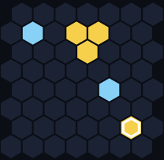 ringed: the fourth stone; blue: a quick-rule reply
   - **No must-answer three inside, still must-answer:** three in one window plus a stone outside it (10 shapes), or four spread-out stones (40; no three in one window, usually two close pairs). These are the easiest to miss. Every one has a cell where a single stone holds (dotted in the catalogue: [three plus one](shapes-catalog.md#4-stones-a-three-plus-one), [spread out](shapes-catalog.md#4-stones-spread-out)). For the spread-out ones, the ringed cells (or their mirror image) of the closest pair, the one with the fewest cells between its stones (off the line if two are equally close), also hold in 26 of the 40.
   - **No reply holds** in 26 four-stone shapes: they're in the catalogue's [unstoppable shapes](shapes-catalog.md#unstoppable-shapes), tagged forced win. Every other four-stone must-answer shape except the fours has its own catalogue entry.
   - Don't skip this step to build your own shape: once they start making fours, you never get to use it.
5. **Do you have a close pair in open space?** Add the two stones (+) that make it an unstoppable shape (see [Close pairs](#close-pairs)).
6. **Does the opponent have a close pair in open space?** Two more stones make it [unstoppable](#unstoppable-shapes), and neighbours or a one-gap pair need only one more for three in a row. Take its two ringed cells (see [Close pairs](#close-pairs)): they stop it growing into an unstoppable shape with a forced win, but they don't stop three in a row, and whether that still wins with your two stones nearby wasn't settled. Two such pairs near each other can already be must-answer (step 4). Otherwise, with two pairs, answer neighbours or a one-gap pair first (a rule of thumb: they have the most ways to finish).
7. **Otherwise, [attack](#attacking).**

**Must-answer** needs a specific reply now (the cheat sheet or the catalogue); a **close pair** needs stones of yours near it (see Close pairs). Nearly every group of enemy stones needs one or the other.

Definitions and details

<table><tr><td align="center">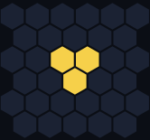 Triangle 1+1</td><td align="center">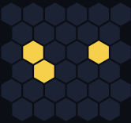 Triangle 1+3</td><td align="center"> Chevron 1+1</td><td align="center">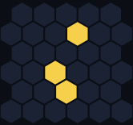 Chevron 1+2</td><td align="center">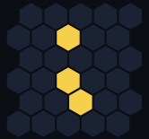 Pair + 1 (2,3)</td><td align="center">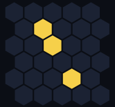 Line 1+2</td></tr></table>

Names: the numbers are how far the two outer stones are from the corner stone. A triangle's lines meet at 60°, a chevron's at 120°. On a line, they're the distances between neighbouring stones.

- 18 of the 41 three-stone shapes are must-answer. Against a two-stone three, only about 5% of all replies hold.
- The two-lines defence works for all 11 threes with two or more lines (A1–A11); against the classic triangle, those pairs are the only replies that hold.
- The one-stone rule works for every one-stone three; some also hold with one stone on other cells (extra cells: A9 1, A11 6, A14 6, A15 1, A18 5).
- The other 23 threes aren't must-answer. 20 of them contain a close pair that two more stones turn into an unstoppable shape with a forced win; with a free turn, any of them becomes unstoppable through three in a row.
- All 7 four-stone shapes in which every three stones form a two-stone three are unstoppable.
- **Inside a four-stone shape** the cheat-sheet replies hold less often: a two-stone three's two-lines reply 63% of the time, a one-stone three's dotted cell alone 41%, a dotted cell plus any second stone within 3 cells 49%. That's why step 4 has its own rules.
- **Triangle a+b, chevron a+b:** two stones on two different lines from a corner stone, a and b cells away. The lines meet at 60° in a triangle and 120° in a chevron; only the equal triangles (1+1, 2+2, 3+3) close into a full triangle. The classic triangle and chevron (boomerang) are both 1+1.
- **Pair + 1 (2,3):** a pair plus a third stone 2 and 3 cells from the two; a one-gap pair has one empty cell between its stones, a two-gap pair two.
- **Line a+b:** three stones on one line, a and b cells apart. Line 1+1 is three in a row.

## Fours

Four stones in one window of six threaten six next turn. With a gap, one stone on a dotted cell holds; the solid four needs both stones (only 3 replies hold, one shown).

<table><tr>
<td align="center">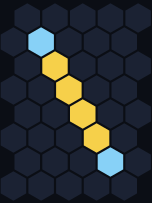 <b>F1</b> both stones · also U6</td>
<td align="center">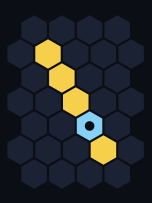 <b>F2</b> 1 stone in a gap · also U46</td>
<td align="center">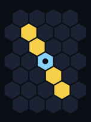 <b>F3</b> 1 stone in a gap</td>
<td align="center">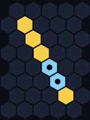 <b>F4</b> 1 stone in a gap · also U51</td>
</tr><tr><td align="center">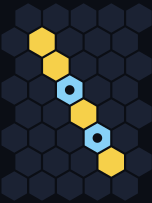 <b>F5</b> 1 stone in a gap</td>
<td align="center">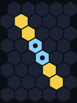 <b>F6</b> 1 stone in a gap</td>
<td align="center">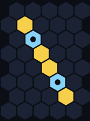 <b>F7</b> 1 stone in a gap</td>
</tr></table>

In open space F1, F2 and F4 win even after the block: each contains three in a row (U1), which is [unstoppable](#unstoppable-shapes). Block anyway: the block stops six next turn, and real games are rarely that open.

## Close pairs

Each close pair becomes an [unstoppable shape](#unstoppable-shapes) with two more stones; one way is marked (+). In open space even a single stone is dangerous: two stones next to it make three in a row, which is [unstoppable](#unstoppable-shapes). Close pairs matter because they give the most ways to a forced win, the kind that never gives the defender a free stone. A **way** is a pair of cells that finishes the pair into an unstoppable shape with a forced win.

<table><tr>
<td align="center">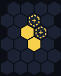 <b>Neighbours</b> add these two → <a href="#unstoppable-shapes">U2 (diamond)</a></td>
<td align="center"> <b>One-gap pair</b> add these two → <a href="#unstoppable-shapes">U4</a></td>
<td align="center">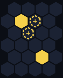 <b>Two-gap pair</b> add these two → <a href="shapes-catalog.md#unstoppable-shapes">U13</a></td>
<td align="center"> <b>Off-line pair</b> add these two → <a href="#unstoppable-shapes">U2 (diamond)</a></td>
</tr><tr>
<td align="center"> your answer: these two</td>
<td align="center">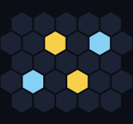 your answer: these two</td>
<td align="center">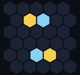 your answer: these two (or their mirror image)</td>
<td align="center"> your answer: these two (or their mirror image)</td>
</tr><tr>
<td align="center">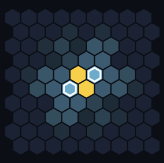 stones on the two ringed cells take away 53 of its 129 ways; the other 76 can all be held</td>
<td align="center">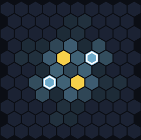 stones on the two ringed cells take away 47 of its 103 ways; the other 56 can all be held</td>
<td align="center">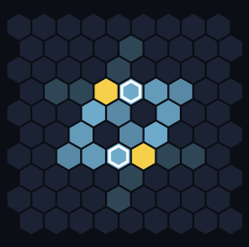 stones on the two ringed cells take away 16 of its 50 ways; the other 34 can all be held</td>
<td align="center">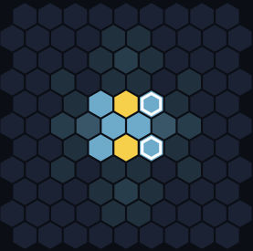 stones on the two ringed cells take away 21 of its 51 ways; the other 30 can all be held</td>
</tr></table>

The maps show the cells the owner can finish with (bluer = more ways). **Two stones on the ringed cells stop it becoming an unstoppable shape with a forced win:** they take away 32 to 46% of those ways outright, and the solver checked every other one with those two stones on the board and found a reply that holds each time (replies within 3 cells). Whether they also stop the ones that need a non-forced win, like three in a row, wasn't checked; your stones nearby at least take away the open space those need. So answer an opponent's close pair in open space with the ringed cells, and don't leave your own pairs where they can be answered this way before you use them.

## Cheat sheet

**Two-stone threes: one stone on each of two blue lines (on the ringed cells).** Any rotation or mirror image works the same way.

<table><tr><td align="center">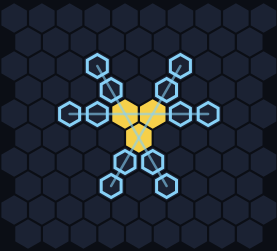 <b>A1</b> · Triangle 1+1 3 lines: pick any two</td><td align="center">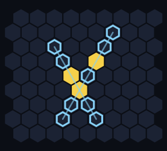 <b>A2</b> · Triangle 1+2 2 lines: one stone on each</td><td align="center">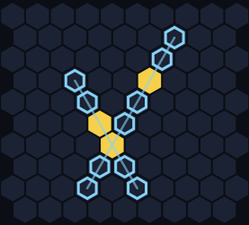 <b>A3</b> · Triangle 1+3 2 lines: one stone on each</td><td align="center">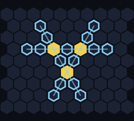 <b>A4</b> · Triangle 2+2 3 lines: pick any two</td></tr><tr><td align="center">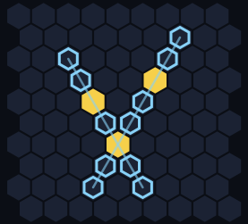 <b>A5</b> · Triangle 2+3 2 lines: one stone on each</td><td align="center">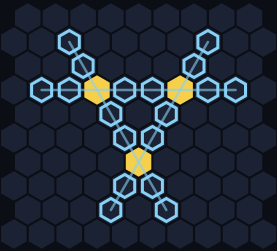 <b>A6</b> · Triangle 3+3 3 lines: pick any two</td><td align="center">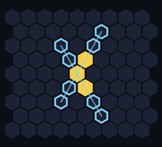 <b>A7</b> · Chevron 1+1 2 lines: one stone on each</td><td align="center">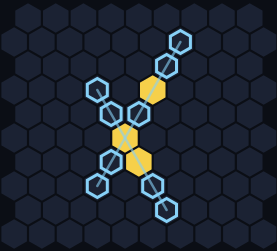 <b>A8</b> · Chevron 1+2 2 lines: one stone on each</td></tr></table>

**One-stone threes: one stone on any dotted cell.** The ringed ones are the rule's cells; every dotted cell works.

<table><tr><td align="center">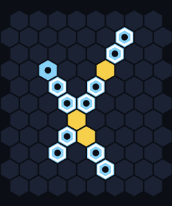 <b>A9</b> · Chevron 1+3 11 one-stone cells</td><td align="center">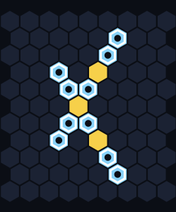 <b>A10</b> · Chevron 2+2 10 one-stone cells</td><td align="center">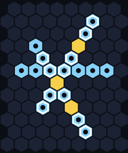 <b>A11</b> · Chevron 2+3 17 one-stone cells</td><td align="center">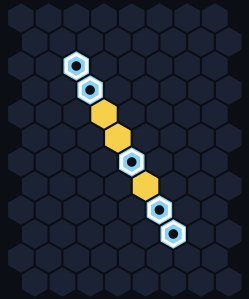 <b>A12</b> · Line 1+2 5 one-stone cells</td></tr><tr><td align="center">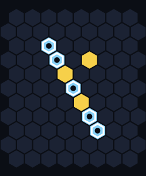 <b>A13</b> · One-gap pair + 1 (2,3) 5 one-stone cells</td><td align="center">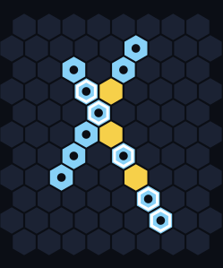 <b>A14</b> · One-gap pair + 1 (2,4) 11 one-stone cells</td><td align="center">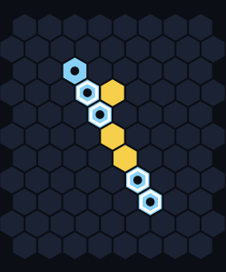 <b>A15</b> · Pair + 1 (2,3) 5 one-stone cells</td><td align="center">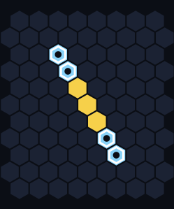 <b>A16</b> · Three in a row 4 one-stone cells</td></tr><tr><td align="center">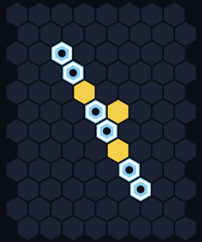 <b>A17</b> · Two-gap pair + 1 (2,2) 6 one-stone cells</td><td align="center">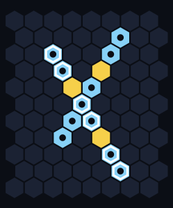 <b>A18</b> · Two-gap pair + 1 (2,4) 11 one-stone cells</td></tr></table>

The three in a row (A16) is also [unstoppable](#unstoppable-shapes) in open space: the reply stops the threats, not the win. Answer anyway, and keep your stones close so the space isn't open.

The defence map and the best holding replies for each are in the [catalogue](shapes-catalog.md#3-stone-must-answer-shapes).

## Attacking

- **Finish a close pair in open space.** If the opponent leaves one of your close pairs alone, the two (+) stones in [Close pairs](#close-pairs) make an unstoppable shape.
- **Turn a close pair into a two-stone three.** One stone does it (+ makes the triangle). The opponent must answer with both stones, and your other stone is free to build somewhere else.
- **Four spread-out stones.** 40 shapes with no three stones in one window and no must-answer three inside are must-answer, and opponents miss them ([catalogue](shapes-catalog.md#4-stones-spread-out)).
- **Keep fours coming.** A four that takes both stones every turn leaves the opponent no time, as in the worked example below.
- **Make three in a row where there's room.** It's must-answer, and in open space it wins even after the opponent answers it (U1).
- **Three in a window plus one.** Three of your stones in one window of six with a fourth stone outside that window (on the same line or off it) is must-answer in 10 of the 50 such shapes with no must-answer three inside (all in the catalogue). Two of them, with the winning first turn outlined:

<table><tr><td align="center">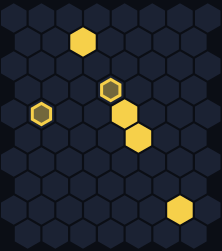 the outlined turn builds its four through the lone stone; six on turn 6</td><td align="center">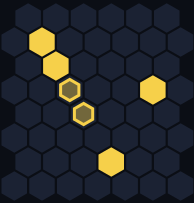 the outlined turn fills the window to five stones, one from six; six on turn 6</td></tr></table>

In these 10 patterns the three alone isn't must-answer. The catalogue has all of them, with the defence map and the best holding replies, under [a three plus one](shapes-catalog.md#4-stones-a-three-plus-one).

## Worked examples

Numbers are turns: a yellow n is X's turn n, and a blue n is O's answer to it. Each picture shows X's new stones and O's latest block bright, older stones dim, and the starting shape bright. Each block is the toughest one the solver found.

### How the triangle wins (A1)

<table><tr><td align="center" valign="top">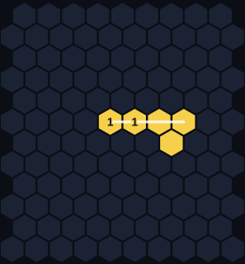 X1: a four · horizontal line</td><td align="center" valign="top">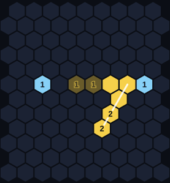 X2: a four · up-right diagonal</td><td align="center" valign="top">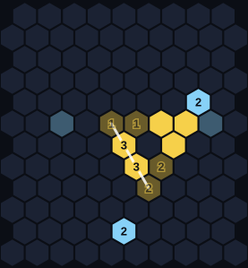 X3: a four · down-right diagonal</td></tr><tr><td align="center" valign="top">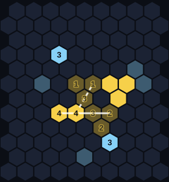 X4: a four and a new three (dashed) · horizontal line</td><td align="center" valign="top">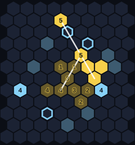 X5: blocking takes 3 stones (one way ringed)</td><td align="center" valign="top">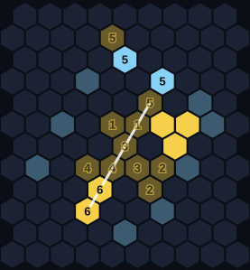 X6: six in a row</td></tr></table>

Every turn is a four that takes both of O's stones, so O never builds anything. On turn 5 the threats need three stones to block, and O has two. The key move is X4: its four also lines up three stones on a second line, which becomes part of the unblockable threats on turn 5.

Turn by turn

1. **X1:** a four on the horizontal line: 2 stones already there plus two new ones. It takes both of O's stones to block.
2. **X2:** another four (up-right diagonal), another two stones for O.
3. **X3:** another four (down-right diagonal), another two stones for O.
4. **X4:** another four (horizontal line), another two stones for O. It also lines up three on the up-right diagonal.
5. **X5:** threats on two lines: the down-right diagonal takes 1 stone and the up-right diagonal takes 2 stones to block. That's more than O's two stones.
6. **X6:** six in a row.

### Defending the triangle (A1)

<table><tr><td align="center">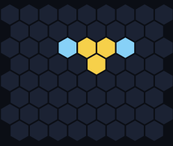 Both ends of one line: loses</td><td align="center">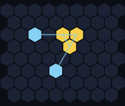 One stone on each of two lines: holds</td></tr></table>

Blocking both ends of one line looks solid, but it leaves the triangle's other two lines untouched, and X still wins with a four every turn. One stone on each of two lines cuts two of the three lines at once, and the solver finds no win after it. After the losing reply, X makes six on turn 6.

Turn by turn after the reply

<table><tr><td align="center" valign="top">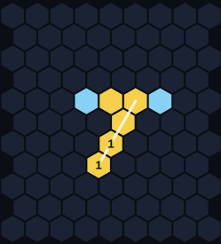 X1: a four · up-right diagonal</td><td align="center" valign="top">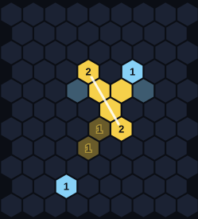 X2: a four · down-right diagonal</td><td align="center" valign="top">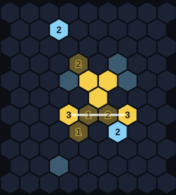 X3: a four · horizontal line</td></tr><tr><td align="center" valign="top">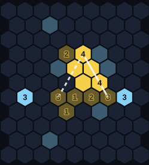 X4: a four and a new three (dashed) · down-right diagonal</td><td align="center" valign="top">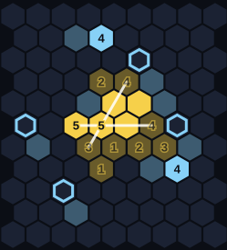 X5: blocking takes 4 stones (one way ringed)</td><td align="center" valign="top">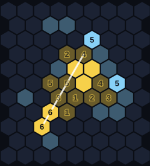 X6: six in a row</td></tr></table>

1. **X1:** a four on the up-right diagonal: 2 stones already there plus two new ones. It takes both of O's stones to block.
2. **X2:** another four (down-right diagonal), another two stones for O.
3. **X3:** another four (horizontal line), another two stones for O.
4. **X4:** another four (down-right diagonal), another two stones for O. It also lines up three on the up-right diagonal.
5. **X5:** threats on two lines: the up-right diagonal takes 2 stones and the horizontal line takes 2 stones to block. That's more than O's two stones.
6. **X6:** six in a row.

## Unstoppable shapes

56 shapes of up to 4 stones win even when the defender moves first, in open space: every two stones the defender can place within 5 cells were checked, directly or through a smaller shape inside. Each is tagged by how it wins:

- **Forced win** (26): a four every turn that takes both of the defender's stones, until one turn's threats can't all be blocked. The solver tried every two-stone reply within 5 cells (about 6,000 to 10,600 of them) and none holds. Easy to play once you see it, and the defender never gets a free stone.
- **Non-forced win** (18): against some defences the owner needs a quiet move. Proven by checking every defender reply after each of the owner's turns, with Six suggesting those turns. Harder to play, and more fragile in a crowded game: the quiet move hands the defender a free turn.
- **Proven by containing one** (12): proven only because it contains a smaller unstoppable shape (your own extra stones never hurt). Shapes in the other two groups can contain one too; their tag says so.

### Three in a row (U1)

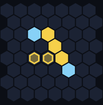

With its owner to move it's must-answer: a four every turn, six on turn 6. With the defender moving first it still wins, but not always by force: against some defences, like the one in blue, the owner answers with a quiet move (outlined), and after it every defender reply loses to a forced win. Real games are crowded, which is why this rarely decides them outright, but it's the reason never to leave a three room to grow.

The four most compact with a forced win that don't contain a smaller unstoppable shape (all 56 are in the [catalogue](shapes-catalog.md#unstoppable-shapes)):

<table><tr><td align="center"> <b>U2</b> · Diamond (two triangles) forced win</td><td align="center"> <b>U4</b> forced win</td><td align="center"> <b>U5</b> forced win</td><td align="center"> <b>U10</b> forced win</td></tr></table>

### Why the diamond (U2) can't be stopped

<table><tr><td align="center"> The two-lines defence on one of its triangles</td></tr></table>

The diamond is two triangles sharing a side. The defence that stops a lone triangle doesn't stop both: X still makes a four every turn and six on the last. After the losing reply, X makes six on turn 5.

Turn by turn after the reply

<table><tr><td align="center" valign="top">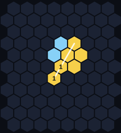 X1: a four · up-right diagonal</td><td align="center" valign="top">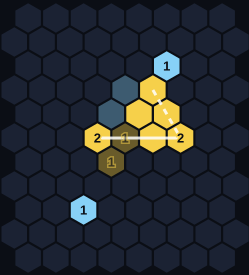 X2: a four and a new three (dashed) · horizontal line</td><td align="center" valign="top">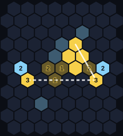 X3: a four and a new three (dashed) · down-right diagonal</td></tr><tr><td align="center" valign="top">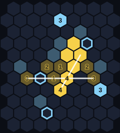 X4: blocking takes 3 stones (one way ringed)</td><td align="center" valign="top">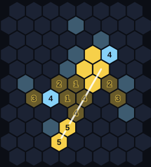 X5: six in a row</td></tr></table>

1. **X1:** a four on the up-right diagonal: 2 stones already there plus two new ones. It takes both of O's stones to block.
2. **X2:** another four (horizontal line), another two stones for O. It also lines up three on the down-right diagonal.
3. **X3:** another four (down-right diagonal), another two stones for O. It also lines up three on the horizontal line.
4. **X4:** threats on two lines: the up-right diagonal takes 2 stones and the horizontal line takes 1 stone to block. That's more than O's two stones.
5. **X5:** six in a row.

The other 769 shapes of 2 to 4 stones are **not proven** either way with the defender moving first. Why no proof: too many defences survived to check them all (601); the proof ran out of time (168). Not proven doesn't mean defendable: proving a defence would mean solving the game around the shape. The [catalogue](shapes-catalog.md#not-proven) lists them with Six's estimate of the owner's chances.

## Test yourself

The answer is folded under each question.

**1. A7 · Chevron 1+1: which reply holds?**

<table><tr><td align="center">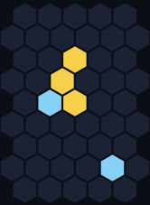 <b>A</b></td><td align="center">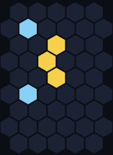 <b>B</b></td></tr></table>

Answer

**B** holds: one stone on each of two of its lines, both within 2 cells, and every such pair holds. The other reply looks the same, but one stone is 3 cells out: some pairs like that hold, this one doesn't.

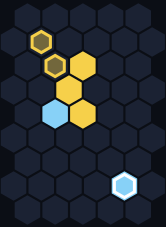

After the other reply, X wins starting here (outlined), with six on turn 6. The ringed stone is the one 3 cells out.

**2. A9 · Chevron 1+3: which reply holds?**

<table><tr><td align="center">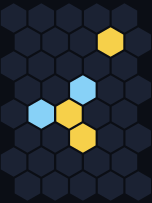 <b>A</b></td><td align="center">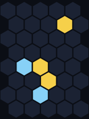 <b>B</b></td></tr></table>

Answer

**A** holds: one stone in a gap on one of its lines is enough. The other reply hugs the shape and looks solid, but neither stone is on any of the shape's lines.

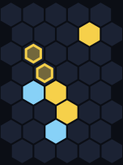

After the other reply, X wins starting here (outlined), with six on turn 6.

**3. F1 · solid four: which reply holds?**

<table><tr><td align="center">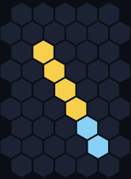 <b>A</b></td><td align="center">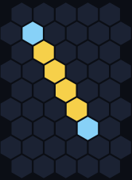 <b>B</b></td></tr></table>

Answer

**B** holds: a solid four needs a stone at each end; it's one of only 3 replies that hold. Two stones at one end leave the other end open. In open space it still wins later, since it contains three in a row (U1): the block only stops the six.

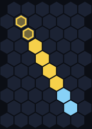

After the other reply, X makes six right away (outlined).

**4. Which one needs the cheat-sheet reply right now?**

<table><tr><td align="center"> <b>A</b></td><td align="center">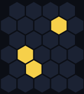 <b>B</b></td></tr></table>

Answer

**B**, the triangle 1+3 (A3): its owner has a forced win if you don't. The line 2+2 (A) has no forced win yet. Treat it as close pairs: take the ringed cells of its most dangerous pair (neighbours or a one-gap pair first, as in step 6).

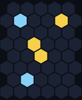

The cheat-sheet reply for B: one stone on each of two of its lines.

**5. You move first. Which one is proven to win for its owner anyway, in open space?**

<table><tr><td align="center"> <b>A</b></td><td align="center">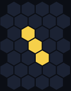 <b>B</b></td></tr></table>

Answer

**B**, three in a row (U1): whatever two stones you place within 5 cells, its owner still wins (see [Unstoppable shapes](#unstoppable-shapes)). The triangle 1+1 (A) is must-answer, but the two-lines defence stops its forced win, and no non-forced win was proven.

## What this doesn't cover

- **Shapes near other stones.** Every shape here stands alone. In a real game the opponent's own threats (a counter-four while defending) and other stones change things.
- **Threes that aren't must-answer.** Answering their most dangerous pair (step 6's order) with that pair's ringed cells is a rule of thumb; the solver check covered pairs on their own, not inside a three.
- **Wins the proofs couldn't finish.** A shape that isn't proven may still win: its proof stopped at a limit (too many defences, the time limit), as listed under [Unstoppable shapes](#unstoppable-shapes).
- **Bigger shapes.** Every must-answer shape of up to 4 stones is on this page (the fours) or in the [catalogue](shapes-catalog.md). For 5 stones it lists the 144 minimal must-answer ones; each has a reply within 3 cells that stops its forced win, but those replies aren't listed. Nothing past 5 stones was checked.

